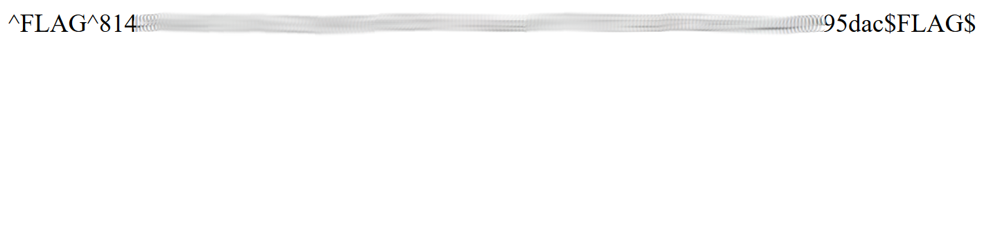

# Hacker101 - 01 A little something to get you started

| Difficulty | Flags |
|------------|-------|
| `trivial`  | 1     |

This is the first challenge of the Hacker101 CTF. It's purpose seems to be to introduce the players to the system.

## What situation do we have?
When starting the challenge we see an bland white page with only one sentence:

*Welcome to level 0. Enjoy your stay.*

[](./assets/hacker101-01-page.png)

Nothing else seems to be on the page, therefore we take a look at the HTML source code:

```html
<!doctype html>;
<html>;
    <head>;
        <style>;
            body {
                background-image: url("background.png");
            }
        </style>;
    </head>;
    <body>;
        <p>;Welcome to level 0.  Enjoy your stay.</p>;
    </body>;
</html>;
```
## flag0 - background.png
In the source code we can see only one clue: the style tag. Curiously it defines a background image, but no background image is actually shown on the page. Lets directly access the image by accessing its path: `/background.png`

[](./assets/hacker101-01-background.png)

So we have found the flag. As said before, this challenge's main purpose seems to be an introduction for the CTF system. I would not really count this as a realistic vulnerability.