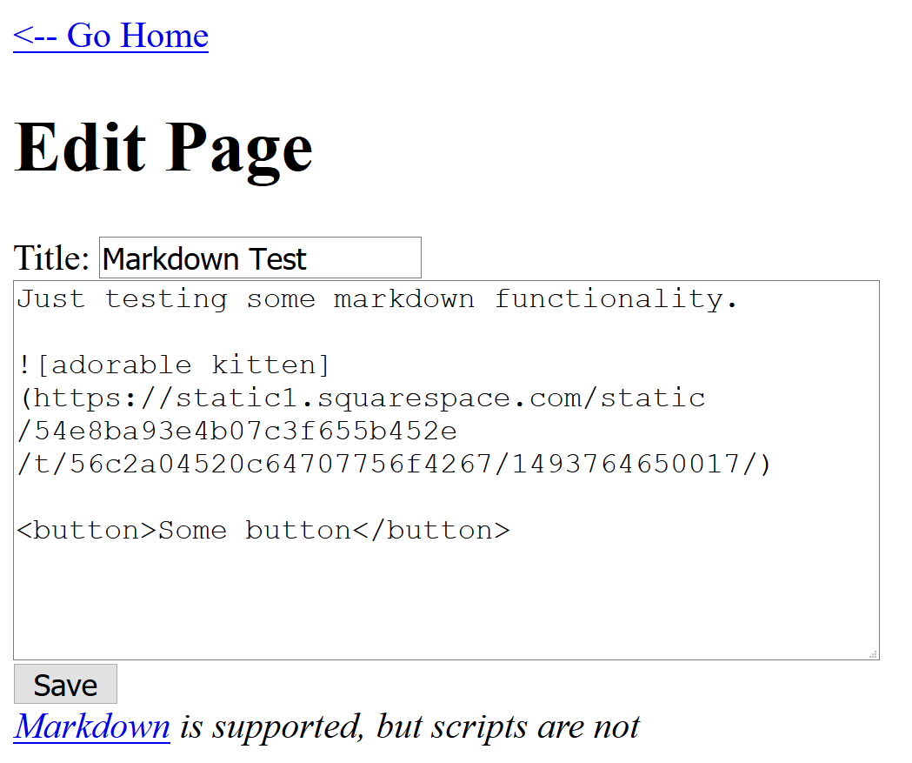

# Hacker101 - 02 Micro-CMS v1

| Difficulty | Flags |
|------------|-------|
| `easy`     | 4     |

Now we are getting a little more advanced. We have to find 4 flags, which can be found with different attack techniques.

## What situation do we have?

When accessing the page, we are greeted by a beautifully desinged content mangement system (CMS). This proposed purpose of this app is to create pages with a markdown editor, which are then listed on the main page. Two sites are already created to begin with.

If we click on the first link, we are forwarded to the first entry of the CMS. Most notable, we can see how the pages are accessed: `/page/1`. Here 1 is the ID of the page.

The second page is similar, only here we can see that actual HTML can also be inserted, as there is a button (without any functionality).

Both pages can be edited by clicking `Edit this page`. We are forwarded to the general page editor where the content of the page is already filled in. Here we see some markdown elements but also actual HTML code being parsed and displayed on the page. It says "scripts" are not allowed, but maybe there is another way around this? 🤔

We can also create our own pages by going back to the main page and clicking `Create a new page`. This sends us to a similar editor, where we can enter a title and body. When saving we are redirected to our newly created page. Most notable, even though the first two pages had IDs 1 and 2, our new page has ID 8. What's up with IDs 3 to 7? 🤔

## flag0 - page 6

As I have noted before, when creating a new page, the new IDs start at 8. IDs 3 to 7 seem to be already in use or somehow reserved. When trying to access these pages with e.g. `/page/3`, we get a code 404, page not found.

Well, for most pages at least. When accessing `/page/6` we get a 403, forbidden. So there is something, we are just not allowed to look at it. Okay, but maybe we can edit it? When trying to access "/page/edit/6", we get the following page:

## flag1 - SQLi?

We saw that we can access pages with their IDs. Think about how you would implement his. Maybe a database is used? We could suspect that there is an underlying query that works something like this:
`SELECT title, body FROM pages WHERE id=1`

The user input in the path is probably used as the id. So we might by able to inject anything we want into this query. Maybe the page is not using a properly prepared statement and is just concatenating the query and our input? Let's test some invalid SQL by for example ending the query earlier than expected with an apostrophe: `/page/1'`

We recieve a 404. Okay, that seems fine. But what about the edit page? `/page/edit/1'`

We instantly recieve the flag. That's a bit surprising, as you would usually need to scrape the database with custom queries at this point, but this is still an "easy" challenge, so we are rewarded with the flag as soon as we think about SQLi. This will change in future challenges.

## flag2 - stored XSS #1

Let's now try the bread and butter of any web CTF challenge: cross site scripting (XSS). We have already noticed the hint, that script tags are not allowed. Is that so? Let's just check that by setting the body of a new page to ``:

As we can see in the source code, the phrase `script` is exchanged with `scrubbed`. This is never a good approach, as often these replacers can be beaten if they don't think of everything. Sometimes switching the casing is enough (e.g. ``). Sometimes we need to use more advanced techniques. But let's not dwell on that to much, we have not tried everything yet. In the body we have at least some sort of defense, but what about the title? Lets set this to ``.

Well okay. This seems to be acutally well escaped, on the first glance. At least on the "view" page... What about the main page?

We are instantly greeted by the flag in an alert. And after that dialouge we get the alert(1); popup as we have created it. Apparently there is no escaping mechanism on the main page. (The German here is just my browser asking if I want to block any more popups from that page.)

## flag3 - stored XSS #2

For the last flag, let's take another look at the escaped script tag in the body of a new page. Apparently `script` is escaped, we accept this for now for simplicity's sake. But are there not other ways to inject scripts into a page?

Let's try eventhandlers. In HTML you can define eventhandlers for tags by just using attributes. An example for this is the `onclick` handler of a button tag. You can set any JavaScript function to be called when this event is caught. This could be a custom function, but also any normal JS function... like `alert()`.

For this to be usable as XSS, the event needs to be triggered whenever the page is loaded. The attack is stronger if the least amount of user interaction is needed, best none at all. So a common way to do this is the `onerror` handler on any element that tries to load something. Often img tags are used with a src that does not exist. So for example:

``

With this we can execute any JavaScript code without using the blocked script tags. Let's test this:

The desired popup shows up. Great! Although this time we don't get another popup with the flag. But if we look at the source code of the page, we can see that a "flag" attribute is added to our img tag. Nice.