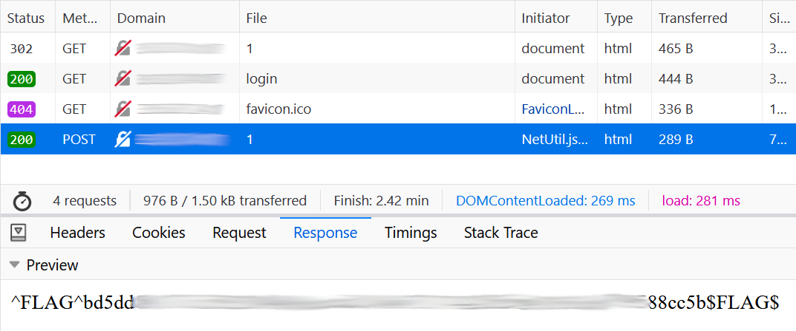
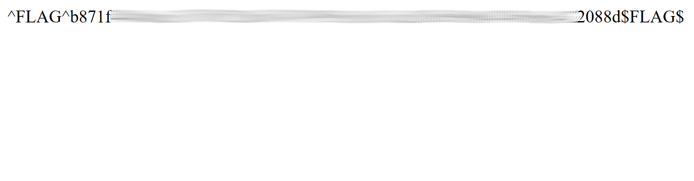

# Hacker101 - Micro-CMS v2

| Difficulty | Skills | Flags |
|------------|--------|-------|
| `moderate` | `web`  | 3     |

This challenge is based on the same application as before, but now they have increased the security. Although not enough as we will see.

## What situation do we have?
We have a very similar site as we had in callenge 02. We are again looking at a content management system (CMS) where users can create their own pages. They can access and edit these.

[](./assets/hacker101-03-page.png)

But if we try to actually create a new page or edit an existing one, we see that not any user can perform these actions. We will always be redirected to a login page, where we are asked to input a username and password.

[](./assets/hacker101-03-login.png)

All we can do as a normal user is looking at already existing pages. This can be done in the same way as before, with the ID in the path like this: "/page/1". When checking for possible IDs we can see now, that the page with ID 3 responds with a 403 Forbidden, while others report a 404 Not Found.

That's all we can do for now, as we don't have any login credentials. But as we will soon see, we can find a way around that problem.

## flag0 - *Who are you? - Yes.*

Let's try our luck on the login form. Of course we have to try the typical "admin/admin" username and password combination, but to no avail. The next best idea is then: How are the users stored? Probably inside a database. So let's try some characters special to SQL to see, if everything is escaped as well as it should be. Lets try "testuser'" with an apostrophe in the end as an username. We are not being logged in, but are rewarded with something even more exciting: a stack trace.

[](./assets/hacker101-03-stack-trace.png)

This is perfect. We can actually see the query the site is performing on the database within the check if the user exists:

```python
if cur.execute('SELECT password FROM admins WHERE username=\'%s\'' % request.form['username'].replace('%', '%%')) == 0:
```

The userinput given in the username is just concatenated to the query. This enables us to add a little something to the query. Let's try this input for the username:

`banana' UNION SELECT 'pineapple';--`

We are expecting this to be concatenated to result in this query:

`SELECT password FROM admins WHERE username='banana' UNION SELECT 'pineapple';--'`

`banana` most probably is not a real username, so this should result in zero rows. But we are attaching another query with UNION, which just outputs the string "pineapple". So the result of the full query will only be one row containing the string `pineapple`. (The two hyphens "--" in the end are necessary to not cause any errors with the excess apostrophe, by making it a comment.)

Now the if check that we saw in the stack trace should be successful. Also this query most probably is also used to retrieve the password from the database, so having it return a string chosen by us, gives us the knowledge of the needed password. So lets try logging in with the username from above and the password `pineapple`:

[](./assets/hacker101-03-logged-in.png)

Jackpot! If we now go back to the main page, we can see the third and previously forbidden page. Acessing this reveals the first flag:

[](./assets/hacker101-03-flag0.png)

## flag1 - POST is the new GET

Let's log out and try something else. As a normal user, we are not able to access any "edit" pages. So for example, if we try to get `/page/edit/1`, we recieve a 302 Found redirect to the login page. But what happens if we try to use POST instead of GET on that path? One way to achieve this is using Firefox's "edit and resend" functionality to change the method of the request.

[](./assets/hacker101-03-post-edit.png)

Sending the request like this makes the server respond with the second flag:

[](./assets/hacker101-03-flag1.png)

## flag2 - A blind request finds a grain of corn.

Let's get back to our SQLi attack from flag 0. We can make the server do any SQL request we want. But we can never really see the result, at least not fully. What we can do is manipulate the password retrieved from the database. Therefore we have access to a boolean output, like so:

We use an IF statement. If it is true, we return `true` as password. If it is false, we return `false`. Example for the username input:

`banana' UNION SELECT IF(1 = 1, 'true', 'false');--`

If we now use `true` as password, we are logged in, as `1 = 1` is always true. This means we have a boolean output for our query. We can now exchange `1 = 1` with another query on the database and try to guess the response, character by character. For example:

`banana' UNION SELECT IF(BINARY SUBSTR((SELECT username FROM admins LIMIT 1), 1, 1) = 1, 'true', 'false');--`

This returns `true` as password, if the first character of the first username in the table admins is an `a`. We can do this now for any possible character and for all following positions in the response string. Doing this looks like this:

[<video width="640" height="360" controls>
    <source src="./assets/hacker101-03-blind-sqli.mp4" type="video/mp4">
</video>](./assets/hacker101-03-blind-sqli.mp4)

You can find the code used for this here: [blind_sqli.py](./assets/blind_sqli.py)

So now we know there exists an admin user called `blanche`. We can also use this to get the corresponding password to that username with the following query for the blind SQLi script:

`SELECT password FROM admins WHERE username = 'blanche' LIMIT 1`

This returns the password `patricia`. If we log in with these credentials, we are rewarded with the third and last flag.

[](./assets/hacker101-03-flag2.png)