# Hacker101 - 04 - Encrypted Pastebin

| Difficulty | Flags |
|------------|-------|
| `hard` | 4     |

This challenge is a bit harder and is focusses on cracking a seemingly secure crypto implementation.

## What situation do we have?

When we start the challenge, we are looking at a pastebin, probably inspired by [pastebin.com](https://pastebin.com). The user can create new webpages with a title and a body and store these in the pastebin. When they send the data, the user is redirected to the newly created page. This is only refrenced by a GET parameter called "post". This parameter contains a fairly long base64 encoded string (with some characters like "=" replaced to not break the URL). If we decode the string, we only get binary data, this does not help at all, it might be encrypted. Any XSS also does not seem to be possible on the created page, so that really only leaves the base64 encoded string as a target. What does it contain? How are the sites referenced?

[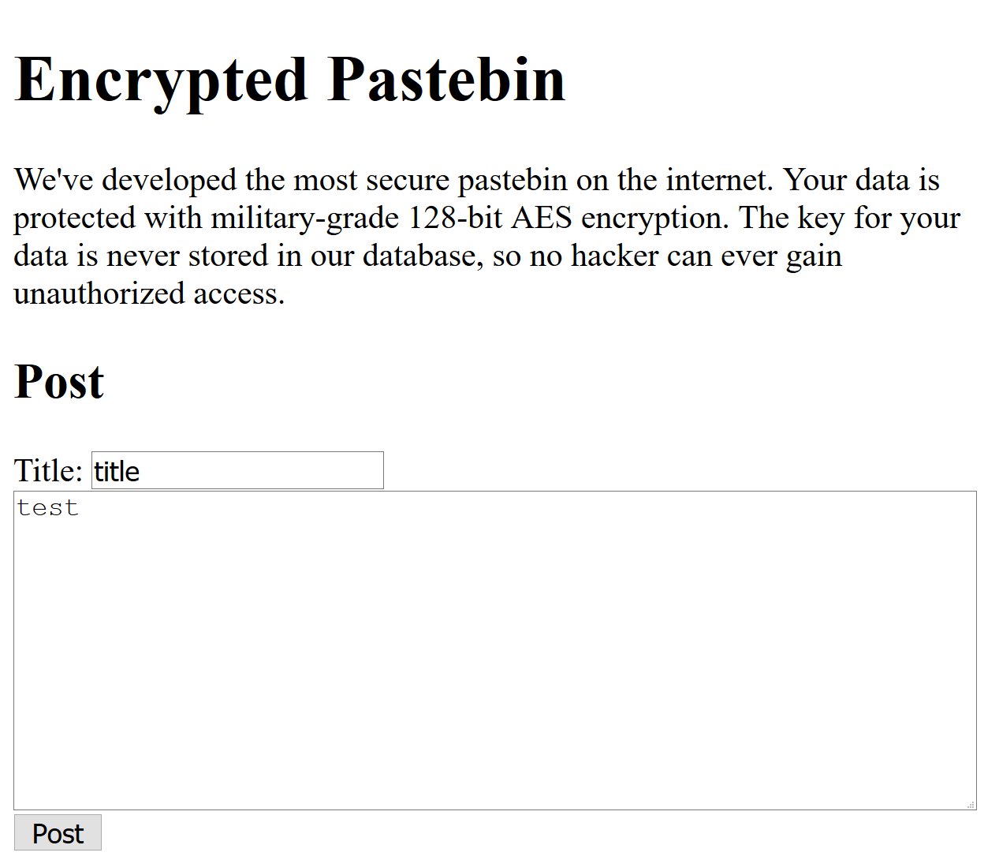](./assets/hacker101-04-page.png)

## flag0 - *We love errors.*

Let's see how the server reacts, when we change something in the "post" parameter. First we create new page to get something that we can modify. This is the result:

```
/?post=9gYH7oQomGv7h7vc8C9gSlL1!aPVbd-Y!lRaslfuHV4TqQ8
RA!NbDaUysCcxfWyMl0FgPZ!Q80qJll21LHlG-R-UXdHrdG0-TaHv4
5V9eFHVN4ftuLTPtcgidDoYslOHBhQ!fPQ-ZYp9V7ajzKOldLClxw-
Z!6V52PwNFJoO9qb4vz1lTHmz1OFaUDKhNM4obrAoVELKvZ0lG7yQ2
h-t2g~~
```

We start in the front and change the `9` into an `8`. The less we change the more likely it is, that the server can still parse some info and we get a deeper look into the system. As before with the hacker101 challenges, the server is nice enough to reward us with a stack trace:

[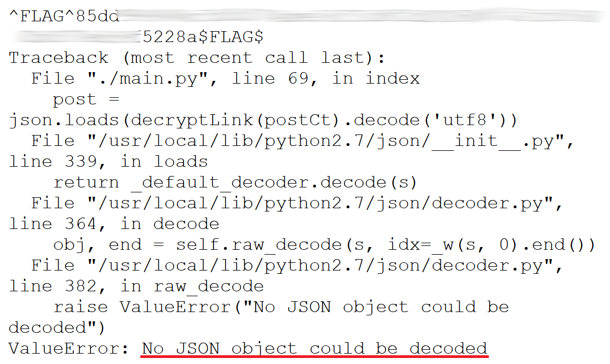](./assets/hacker101-04-flag0.png)

Whoops. This has already gotten us the first flag. Nice. But that's not all. We can see the server expects a JSON object. My guess is, we have broken the first curly brace. Interesting. Let's continue by resetting the parameter and change the third character: `Y` -> `X`

[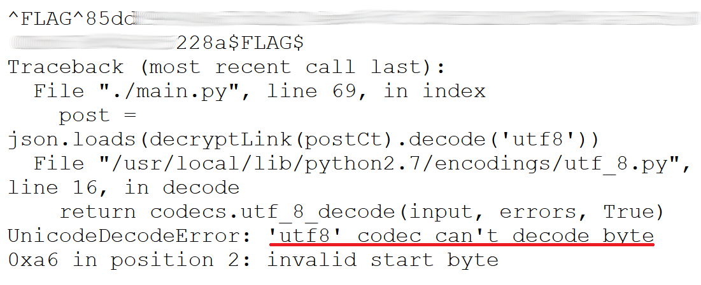](./assets/hacker101-04-stacktrace0.png)

This time we have broken the UTF-8 encoding. This does not give us much information about the implementation. Let's now try a very short input. To make it easy and keep the base64 padding intact, we need a multiple of 4 characters. So we cut everything but the first 4 characters and see what happens.

[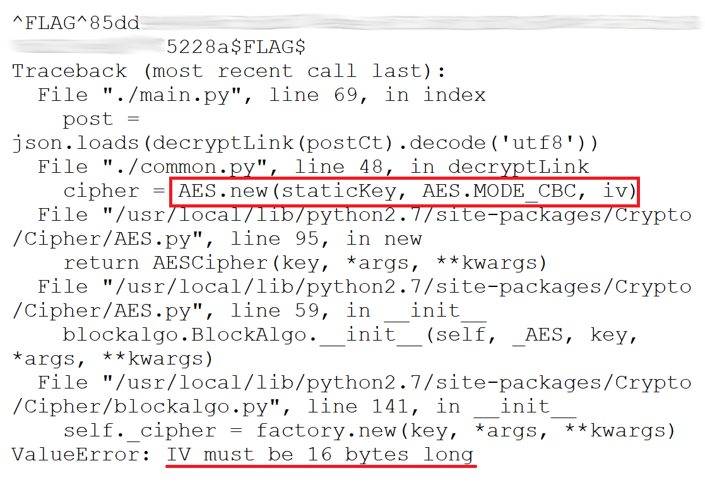](./assets/hacker101-04-stacktrace1.png)

Okay, this confirms our assumption that the "post" parameter is encrypted. We actually get a lot of information here: AES is used. The mode of operation is CBC. A static key is used, probably the same for all requests. The block length is 16 byte, as the IV needs to be that long.

The server has been very open with its error messages so far. Could we coax it into telling us something about the AES padding? Let's fiddle around with the last characters and try to break the padding.

[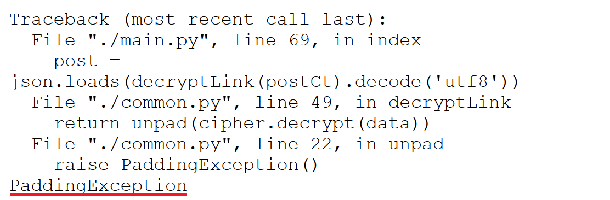](./assets/hacker101-04-stacktrace2.png)

Of course. So, we have a full-fledged padding oracle for an AES-CBC implementation at our disposal. For the next flag we will use that.

## flag1 - *Dear oracle, tell me the plaintext.*

This one will be a bit more complicated. As I am trying to be a bit educational with these writeups, I will first talk a bit about the CBC mode and how the padding and the IV are used, then I will get to the part on how to break it if the server leaks too much information.

### Cipher Block Chaining (CBC) Mode

Blockciphers have fixed blocklengths. In our case, the AES implementation uses a blocklength of 16 bytes. But most often a user wants to encrypt messages that are longer than 16 bytes. They could simply split the message up in several blocks and encrypt them one by one. If they then just concatenate the blocks and use this as the ciphertext, they are using a mode called "Electronic Codebook" (ECB). This is not safe. The simplest way to show this is using pictures:

[](https://en.wikipedia.org/wiki/File:Tux.jpg)
[](https://en.wikipedia.org/wiki/File:Tux_ecb.jpg)
[](https://en.wikipedia.org/wiki/File:Tux_secure.jpg)

*All three images are taken from this Wikipedia article: [Block_cipher_mode_of_operation - Electronic_codebook_(ECB)](https://en.wikipedia.org/wiki/Block_cipher_mode_of_operation#Electronic_codebook_(ECB))*

In the first picture we can see the plaintext that we want to encrypt, an image of Tux. The second picture shows the ciphertext, encrypted using EBC mode. We can still clearly see the outlines of Tux. That is because there is no randomness in the ciphertext. The same plaintext pixels will always lead to the same ciphertext pixels. But as you can see, this is clearly not secure. The third picture shows the result using any other mode that employs pseudo-randomness, e.g. the CBC mode.

But how does CBC employ randomness for each encrypted block? And how is it possible the decrypt something, if the outcome is always random? Let's take a closer look at how CBC works in general. The following figure shows the encryption using a generic blockcipher. Blocks with label `m` are plaintext blocks, `c` denotes ciphertext blocks. `E_BC` is the encryption of the blockcipher which uses the key `k`. The interesting part is now the green block, the Initialization Vector (`IV`). This is a pseudorandom block of the same length of any other block. In the figure you can see that before encrypting the first plaintext block, it is XOR'ed with the IV. Then after encrypting, the resulting ciphertext block is then also XOR'ed on the next plaintext block. From here on the schema continues until the last plaintext block is encrypted. The reciever of the encrypted message gets the `IV` concatenated with all ciphertext blocks.

[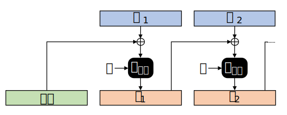](./assets/hacker101-04-cbc.svg)

The decryption process is very similar. The reciever of the message just inverts the process and XOR's the `IV` on the result of the first decrypted block. Then the first ciphertext block is XOR'ed on the next result, and so on and so forth. This is repeated until they have decrypted the full message. This process is depicted in the figure below.

[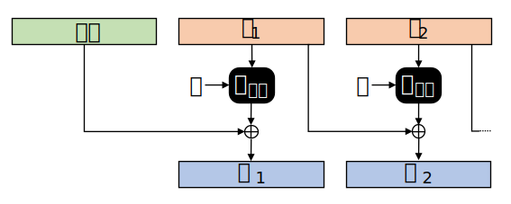](./assets/hacker101-04-cbc-dec.svg)

For now we have assumed that the message fills every block perfectly. But that is obviously not always the case. Sometimes your message can be some bytes shorter than it needs to be to fill the last block completely. For this, padding needs to be used. The padding consists of "filler"-bytes that are appended to the plaintext message. For our case in the challenge, the padding follows these rules:

- The last block always needs to contain padding, even if it would not be necessary. In that case you need to append a full block of padding.
- The value of every padding byte is the length of the padding. A 3 byte long padding would for example have the following hex representation: `0x030303`

Let's now assume, our generic block cipher has a block length of 8 byte. The decryption with a padding would look like this:

[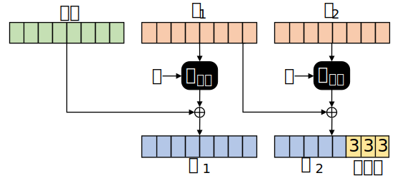](./assets/hacker101-04-cbc-pad.svg)

### Attacking a Padding Oracle

Up until this point, everything seems fine. We have the randomness, every ciphertext is connected, all looks good. But remember that we have found out, that the challenge server tells us, when the padding is incorrect. It would for example be incorrect, if we flipped a bit in the padding and it looked like this: `0x030203`. But how does this help us?

Let's remember our situation. We send ciphertexts to the server, which decrypts them and uses them to retrieve a previously stored page from its database. The important part is, that we can construct the ciphertexts ourselves. That means, we have full control over all blocks, especially the `IV` block. The server will always respond to us in some form. If the stack trace contains the string "PaddingException", the padding was invalid. Otherwise it was valid. This we can use as a so called "padding oracle".
With this we can directly change the resulting plaintext of the first block. If we for example change the last byte of the `IV` and only send `c_1`, the padding would most probably be invalid. There are only two possibilities where we have a valid padding:

- The last byte results in a 0x01 after XOR'ing. A 1 byte long padding is valid. This is possible in 1/256 cases.
- Some bytes before the last byte have the same low plaintext values, such that a longer valid padding could be created, like `0x030303`. But that is rather unlikely.

To make the last case even more unlikely, we choose a new randomized `IV'` (but store the original one!). Now, we can try every possible value between 0 and 255 and XOR it on the last byte of our new `IV'`. See the following figure for more clarity. Also note, that the output of the decryption is now denoted as `x`, which we will need later on.

[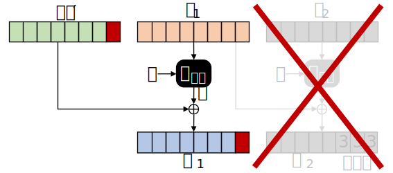](./assets/hacker101-04-cbc-oracle1.svg)

In one of these test cases the padding will be valid. And in this case we actually know that the resulting plaintext byte must be 0x01. Let's put the equation together, what have we actually learned? We know the following:

`m_1[7] == 0x01 == IV'[7] ^ x[7]`

*`m_1[7]` here is the seventh byte of `m_1`. `^` is the XOR operator.*

But remember, that we know the bytes of *IV'*. Therefore we can reorder the equation to learn a byte of `x`:


`x[7] == 0x01 ^ IV'[7]`

This is one byte of the output of the decryption function! This is almost a win. We now only need the old IV to calculate the actual plaintext byte:

`m_1[7] == x[7] ^ IV[7]`

We have learned one byte of the plaintext, and it has only taken us a maximum of 2**8 == 256 requests to the oracle. And we can actually continue. Now, that we know the last byte of the plaintext, we can use the IV again and set it to any value we want. For example: 0x02. If we do this, we can test for the next byte. See this figure for reference:

[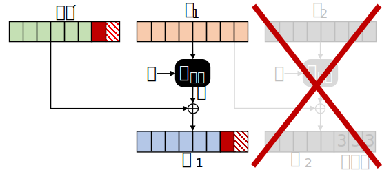](./assets/hacker101-04-cbc-oracle2.svg)

To manipulate the last byte accordingly, we have to set the `IV'` byte like this:

`IV'[7] = IV'[7] ^ IV'_found[7] ^ x[7] ^ 0x01 ^ 0x02`

*Whereas `IV'_found` contains the `IV'` bytes with which the correct padding was found.*

*note:* `IV'_found[7] ^ x[7] == 0x01`

With `IV'[7]` set like this, we can try every byte for `IV'[6]` and repeat the steps from above. We can now also do this for all remaining bytes and finally recieve the full plaintext of block `c_1` after only a maximum of 8 * (2**8) == 2.048 requests to the oracle.

But it does not stop here. We can also decrypt all other blocks with the oracle. If we for example want to decrypt block `c_2`, all we need to do is use `c_1` as the `IV` and `c_2` as the first ciphertext block. The approach is otherwise the same. With this we can decrypt the full ciphertext block by block.

[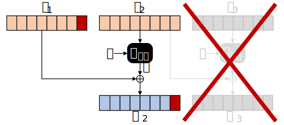](./assets/hacker101-04-cbc-oracle3.svg)

### Implementing the Attack

I am fully aware that there are tools out there for scenarios like this (e.g. PadBuster [tools.kali.org/web-applications/padbuster](https://tools.kali.org/web-applications/padbuster). But that is boring. Therefore, I implemented this attack in Python by myself. The full code is a bit too long to explain it here, but the approach described above is pretty much exactly what I did. The only really notable difference to the example above is the blocklength. In the challenge it is 16 bytes, not 8. But that does not change the algorithm at all. You can find the code here: (pad_oracle.py)[./assets/pad_oracle.py]

The only downside of this attack: It takes a while. A ciphertext consists of 9 blocks (+ 1 `IV`). For each block we need to make an average of 1.024 oracle requests, so a total of almost 10.000 requests. This would not be that much, but the connection to the challenge containers is a bit slow. Probably on purpose to prevent killing the system with too many requests. All in all it takes more than one hour to decrypt one ciphertext with my implementation. It is definitely possible that this can be improved, but I did not bother to try, to be honest.

### Executing the Attack

To execute the attack and extract the flag, we first need to create a new page. In my case, I got forwarded to a page with the GET parameter "post" being set to a long base64 value. As we have found out before, this is the ciphertext. Decrypting this with our padding oracle implementation leads to the following plaintext:

```json
{
    "flag": "^FLAG^1b97...REDACTED...de51$FLAG$", 
    "id": "2", 
    "key": "PFimCnjhQhq4qMJhPTe1Ew~~"
}
```

Nice, we found a flag! And we can also see that the stored pages are accessed with an ID. So they are probably stored in a database. And the pages are probably encrypted and the key to decrypt them is sent in the parameter. But there is one thing to notice: We have created only one new page. Why does the ID start at 2? 🤔

## flag2 - CBC Malleability

After decrypting the ciphertext, we found that the first new page starts with ID 2. Let's try to find out what page 1 looks like. For this, we use a weakness of the CBC mode: malleability. This is actually something that we have used in the attack for flag 1. Changing the ciphertext of the previous block leads to a controlled change in the current plaintext block. How is the current plaintext organised when structured in the corresponding blocklength?

```json
{
    "flag": "^FLAG^1b97...REDACTED...de51$FLAG$",
    "id": "2",
    "key": "PFimCnjhQhq4qMJhPTe1Ew~~"
}
```

Okay, the first byte of the seventh block is the ID. All we need to do is manipulating the ciphertext of the sixth block to change the ID. But if we do that, all bytes of the plaintext of the sixth block will be scrambled, because changing only one bit for AES affects all bits of the output.

This does not work as easy as anticipated. But maybe the "flag" property is not required for the system to work, maybe we can change the plaintext to something like this:

```json
{
    "id": "1",
    "a": "2",
    "key": "PFimCnjhQhq4qMJhPTe1Ew~~"
}
```

All we would need to do is use the sixth block as *IV* and throw blocks 1 to 5 away. But the downside is, we need so change almost all bytes of the *IV*. But we will manage. The equation for each byte would be this:

`IV'[i] = c_6[i] ^ m_6[i] ^ m'[i]`

Here `IV'` is the new `IV` that we are going to use, `c_6` is the sixth ciphertext block, `m_6` is the sixth plaintext block and `m'` is the desired plaintext as described above. Let's test this.

[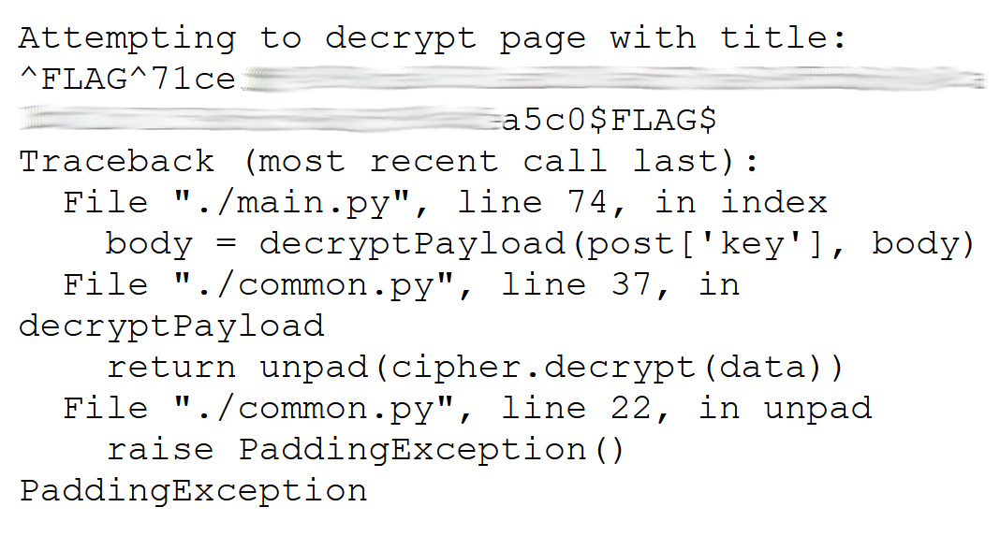](./assets/hacker101-04-flag2.png)

We get a new stack trace! Although it seems pretty familiar. There was a padding exception while trying to decrypt a page. Most probably because the sent key was just wrong for the page that we requested. But this time the title of the page is displayed. Conveniently, this is the next flag.

## flag3 - ???

This flag has me puzzled. I was not able to solve the last challenge yet. My current guess is, that we need to perform an SQL injection on the ID parameter. But I was not able to do so without ruining some parts of the plaintext.

I have put this on hold for now, as uni has started again and I have already put quite a lot of time in this challenge. But I might try this again later on. I am open for any tips and suggestions nonetheless!