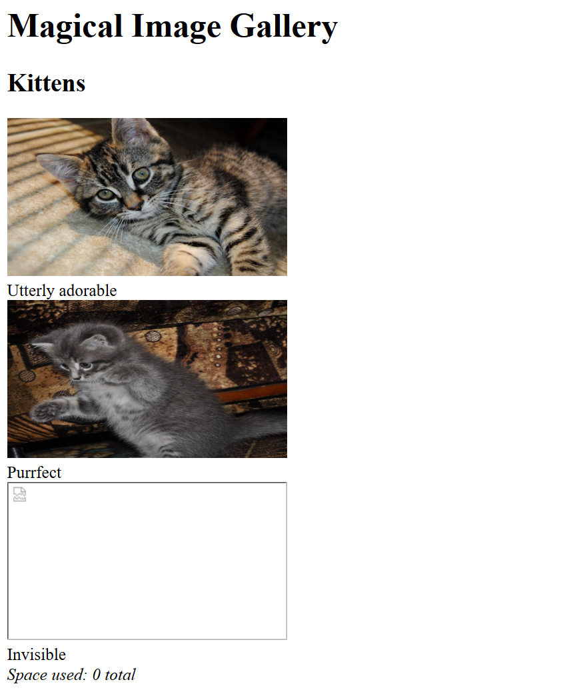
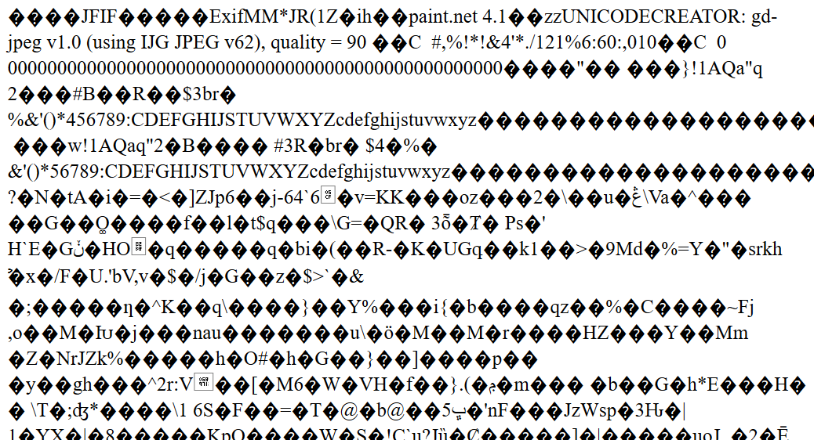
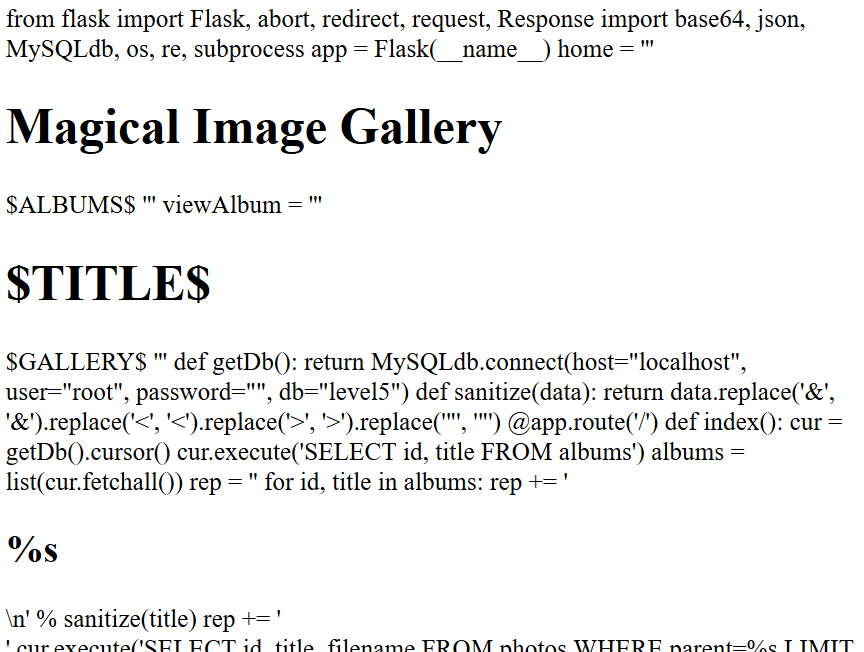
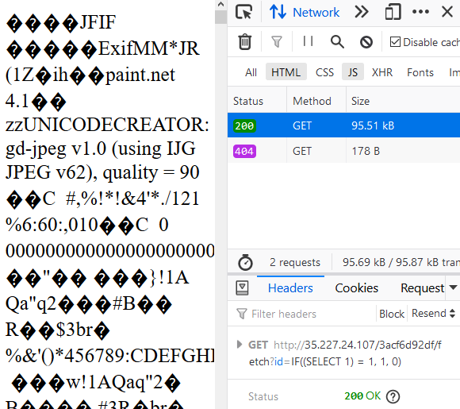
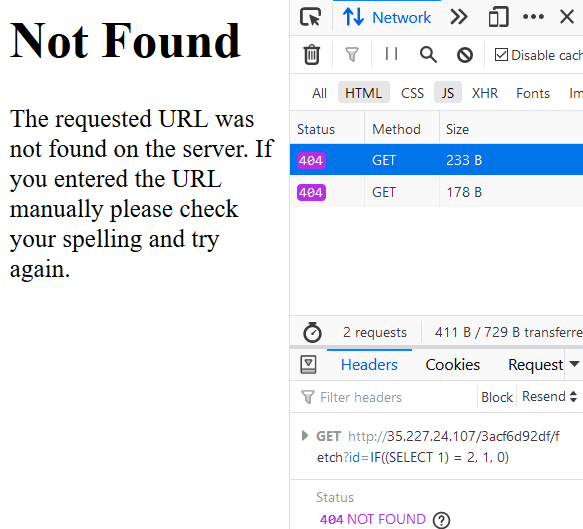
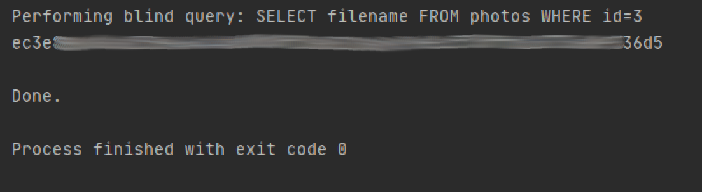
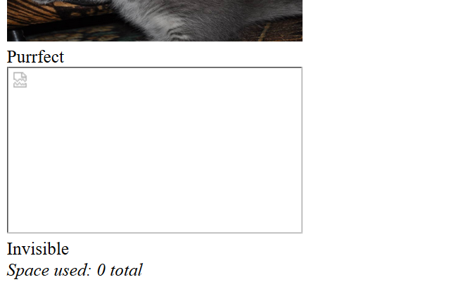
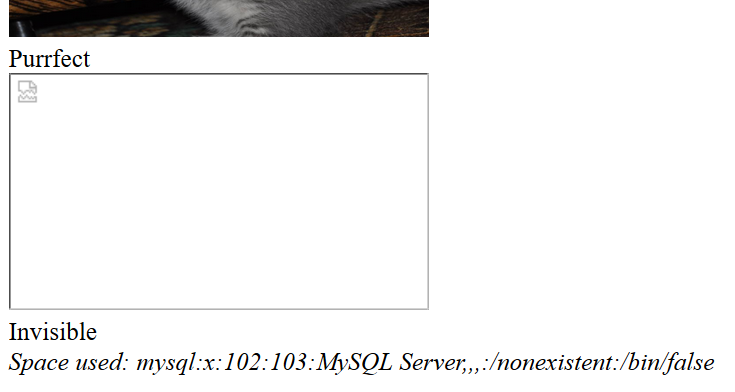
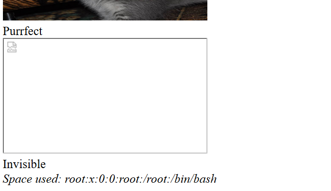
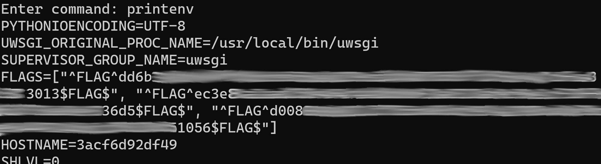

# Hacker101 - Photo Gallery

| Difficulty | Skills | Flags |
|------------|--------|-------|
| `moderate` | `web`  | 3     |

This time we are looking at a simple page that displays some pictures of cats. As it uses a database to access these pictures, the attacks will mainly focus on SQL injection again. But there is also some remote code execution involved.

## What situation do we have?

When opening the challenge, we are greeted by two very adorable kittens. It seems like a third one is supposed to be displayed, but the page was not able to load the image. This one is also titled "Invisible", so this might be a hint that we should futher investigate this.

[](./assets/hacker101-05-page.png)

Looking at the source code of the page, we can see that the `src` attributes for the images are done with a GET request to a `/fetch` page of the challenge. Let's open the `src` URL for the first picture, which is `/fetch?id=1`:

[](./assets/hacker101-05-img1.png)

Interesting. Instead of displaying the image, as we would normally expect it to do, we get the bytes of a .jpg file. We know this, because the first chars seem to be the header of a .jpg. We are also accessing the image with a GET parameter called `id`... hmm... could this be the ID of a row inside an SQL database?

## flag0 - The State of the UNION.

The title I gave this flag is taken from one of the hints that the challenge gives us: *Take a few minutes to consider the state of the union.* So let's exactly do that.

How would the images be stored for this challenge? It is rather unlikely, that the full bytestream is put inside a row of a database. So maybe only the paths to the files are stored. This could be what the server is retrieving from the database to open the file and send the bytestream to the client. We could try to access any files by entering an invalid ID and adding another `SELECT` statement to the query with a `UNION`. Of course, for that we need to be able to append anything we want to the query. For now, let's just assume that we are.

Most other challenges were hosted with a python server. Let's also assume that this is the case here again. So maybe we are lucky and can access it's source code? It could be named `main.py`... So we can just try this query:

`/fetch?id=0 UNION SELECT 'main.py'`

*note: We should normally use URL encoding here, so replace the spaces with `%20` and the single quotes with `%27`. But I went without those here to make it more readable.*

This is the response:

[](./assets/hacker101-05-main.png)

It seems like we got lucky! As the first lines start with the typical python library import stuff, we are probably looking at a python file which also contains some HTML. It's easier to just look at the source code of the displayed page. As it is a bit too big, you can see it here: [main.py](./assets/main.py)

And if we look at the last lines, where the "fetch" route is defined, we can see a flag. Nice.

## flag1 - The Invisible Kitten.

As we have seen when we had our first look at the page, the third image could not be displayed. Looking at the source code that we got with the first flag, we can see the structure of the database. It contains (at least) two tables, `albums` and `photos`. The `albums` table seems to have two columns, the ID and the title of the albums. The server first gets all IDs for any existing albums and then uses these for the query to the `photos` table. This one seems to have four columns: `id`, `title`, `filename` and `parent`. The server gets all photos for the given album ID in the `parent` table. It uses the `title` as the subtitle for the images. The ID is used for the query on the `/fetch` route, where the `filename` is queried from the same table and opened with `file(filename).read()`.

What can we do with this info? I would be nice to take a look at the filename of the third image. Why can it not be opened? But we can not get any output from the database other than the content of files, as the output is just put into `file(QUERY_OUTPUT).read()`.

Let's think back to challenge 03. There we used blind SQLi to read anything from the database. Can't we do the same here? What about this request to the fetch page:

`/fetch?id=IF((SELECT 1) = 1, 1, 0)`

If blind SQLi is possible, this should just yield the same result as `/fetch?id=1`. And it does! We get a status code 200:

[](./assets/hacker101-05-200.png)

And if we use the following query, we should just get an error:

`/fetch?id=IF((SELECT 1) = 2, 1, 0)`

[](./assets/hacker101-05-404.png)

Nice, we can use this for a blind SQL contruction similar to the one from challenge 03, by looking at the status codes. We are basically performing arbitrary queries on the database and look at only one character of the response. We guess every possible charater and only if we recieve a code 200, our guess was correct. I have implemented this quite similarly as before, you can find the code here: [blind_sql.py](./assets/blind_sql.py)

Now we want to see the filename for the ID 3. Let's try the following query:

`SELECT filename FROM photos WHERE id=3`

[](./assets/hacker101-05-flag1.png)

Okay, here we can see why the file could not be opened. The filename is just the next flag!

## flag2 - Remote Code Execution (RCE)

For the last flag, let's take another look at main page. The last line seems to be a counter of the file space used by the pictures. How is this calculated? Luckily we have the source code. Here is the line responsible for this:

```python
rep += '<i>Space used: ' + subprocess.check_output('du -ch %s || exit 0' % ' '.join('files/' + fn for fn in fns), shell=True, stderr=subprocess.STDOUT).strip().rsplit('\n', 1)[-1] + '</i>'
```

`rep` is the variable that later contains all the dynamically created output of the main page. `fns` contains all the filenames from the photos table. The function `subprocess.check_output()` is used to execute a shell command. The command in question is `du -ch file1 file2 file3` which prints the used space for all given file paths. If the command fails, it exits with code 0. `file1 file2 file3` are actually the filenames in the list `fns`.
We have seen before that we can perform any query on the database we want. We only used this for `SELECT` queries. But is this not also possible for `UPDATE` queries? Maybe we can `UPDATE` the filename of the third file, which is not a valid filename anyway, to get our own shell commands into this? Let's take a closer look at how the shell command is generated:

`'du -ch %s || exit 0' % ' '.join('files/' + fn for fn in fns)`

The `%s` is replaced by the string that follows after the `%`. This string is created with `' '.join()`, while a list is given into `join`. `join` concatenates all entries in the list with the string on which it is called. For example `' '.join(['a', 'b', 'c'])` results in `'a b c'`. Also before putting the filenames into the `join` functions, `files/` is prepended.

This looks very promising! If we now change the last filename, the filename of the third file, to something like `validfilename.jpg; cat /etc/passwd` we could be able to execute any command we want. The result would be in the `Space used` output. But for that we need a valid filename. Easy, we just use the blind SQLi code from flag1 to get the filename of the first file: 

`files/adorable.jpg`. 

All we need to do now is to change the last filename. Let's try the following request to the `/fetch` page:

`/fetch?id=1; UPDATE photos SET filename = 'files/adorable.jpg; cat /etc/passwd' WHERE id=3`

We are getting a code 200, that means the SQL query did not cause an error. So now we should see the output on the main page...

[](./assets/hacker101-05-rce1.png)

Hmm... Nothing has changed. Maybe our UPDATE query was not commited? With MySQL, you can configure if changes are commited automatically or not. So let's add a COMMIT to our query and try again:

`/fetch?id=1; UPDATE photos SET filename = 'files/adorable.jpg; cat /etc/passwd' WHERE id=3; COMMIT`

[](./assets/hacker101-05-rce2.png)

Nice! This time we get an output. But only one line... Let's check the server's source code again:

`rep += '<i>Space used: ' + subprocess.check_output(...).strip().rsplit('\n', 1)[-1] + '</i>'`

Oh. The output is split with `.rsplit('\n', 1)` and only the last element of the resulting list is used. But that should not stop us. Let's adjust our shell command. We can specify which line of the output we want by just piping it into `sed`. Like so:

`cat /etc/passwd | sed -n 1p`

This should only return the first line of our command.

[](./assets/hacker101-05-rce3.png)

And it works! All we need now is a script that automates this for us, so we can take a look around with our easy to use RCE. You can find my implementation here: [rce.py](./assets/rce.py)

When put into action, this looks like this: [hacker101-05-rce.mp4](https://raw.githubusercontent.com/pkemkes/ctf-writeups/main/hacker101/05/assets/hacker101-05-rce.mp4)

The question that remains is now: Where is the last flag? It wasn't in /etc/passwd. After some digging I found it (and all other flags as well) in the environment variables:

[](./assets/hacker101-05-flag2.png)