# Hacker101 - 07 - Postbook

| Difficulty | Flags |
|------------|-------|
| `easy`     | 7     |

We are hacking Facebook! Oh no, wait... Postbook? This challenge aims to be a comparable social media site. We have a lot of flags to find, most of the attacks are logical flaws.

## What situation do we have?

As I said, we are looking at a page, that resembles the well known social media platform Facebook (if you squint your eyes, maybe...). 

[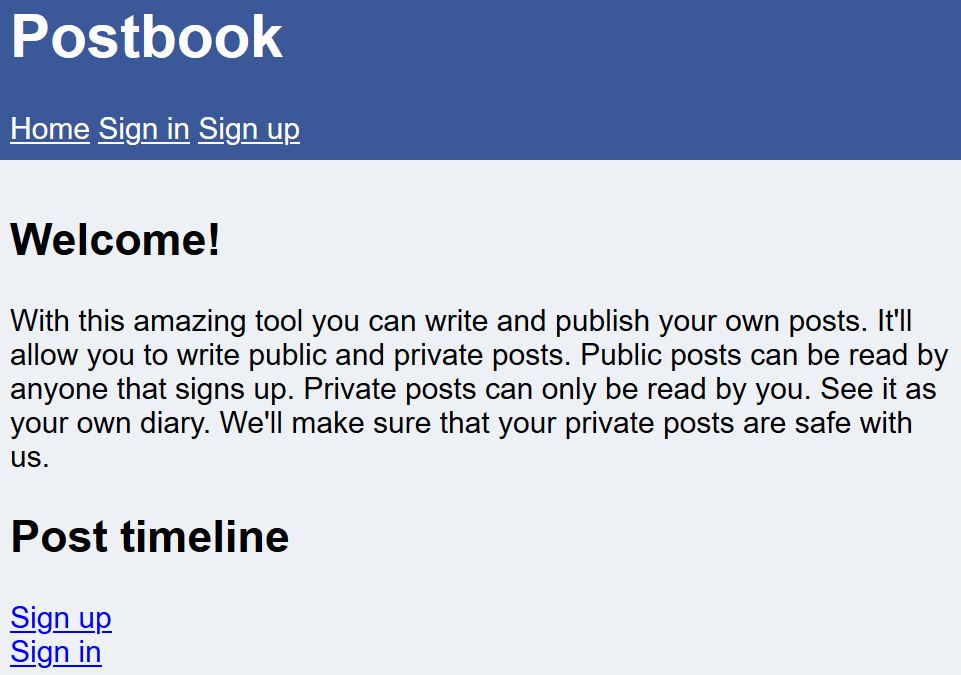](./assets/hacker101-07-page.png)

All we can access for now are links to the `Sign up` and `Sign in` page. Let's try to sign up:

[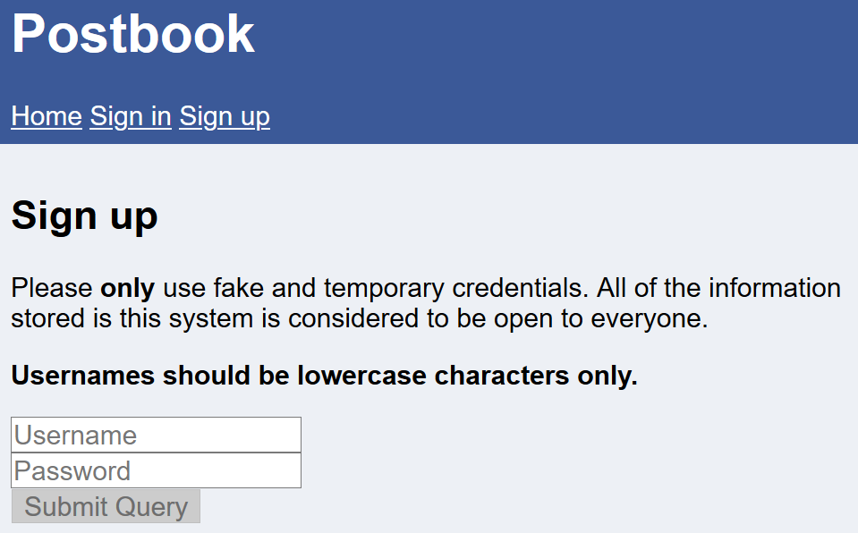](./assets/hacker101-07-sign-up.png)

Well that's a very bad advice for creating user accounts. *Fake and temporary credentials? All information is considered open to everyone?* Why is there a need for credentials in the first place then? Anyways, we create a new user called `evil` with a simple password.

[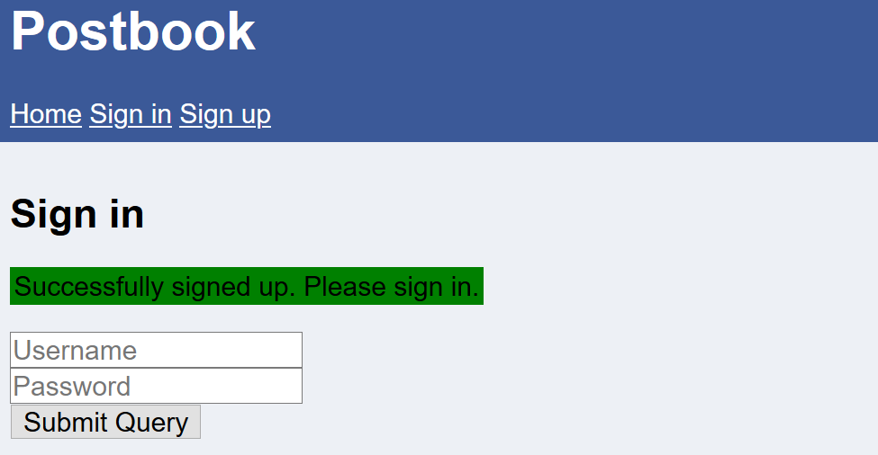](./assets/hacker101-07-signed-up.png)

Looks like that worked. Now we try to login with these credentials:

[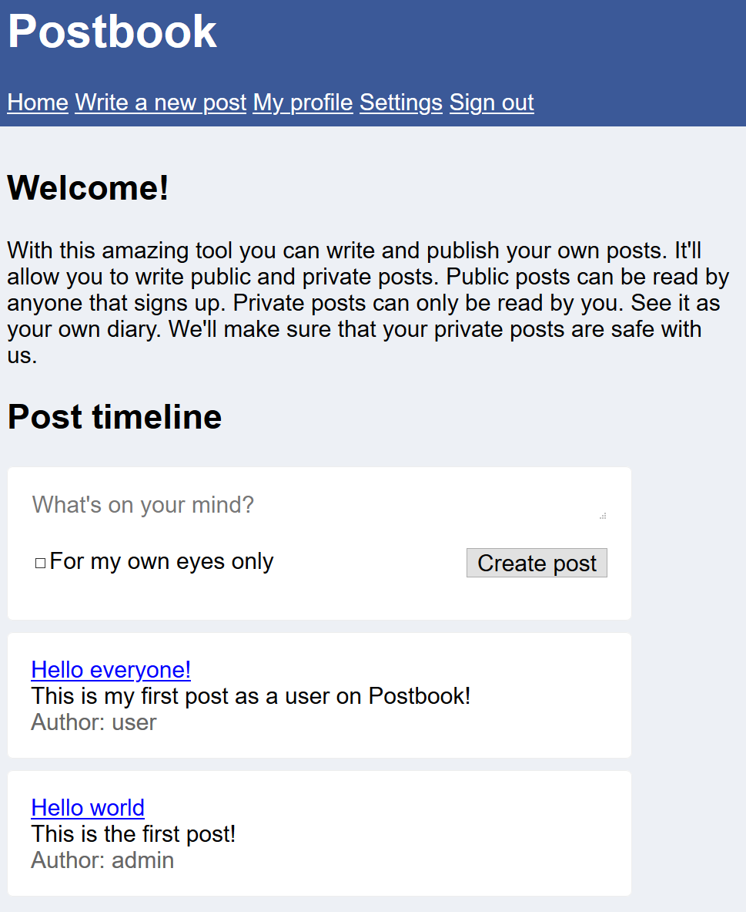](./assets/hacker101-07-signed-in.png)

It seems we are a normal user on the platform now. We can write a post, inspect our profile, adjust some settings, sign out and view other posts. As we have a lot of vulnerabilities to cover here, we will discover the full website on the fly from here on.

## flag0 - Hello, my name is user

When looking at the frontpage of the site, we can see two posts, one created by admin and one by user. Remember the bad hint when creating an user account? Only *temporary* credentials should be used? Well... let's see if we can't guess user's password... Maybe it's `password`? We sign out again and try the guessed credentials:

[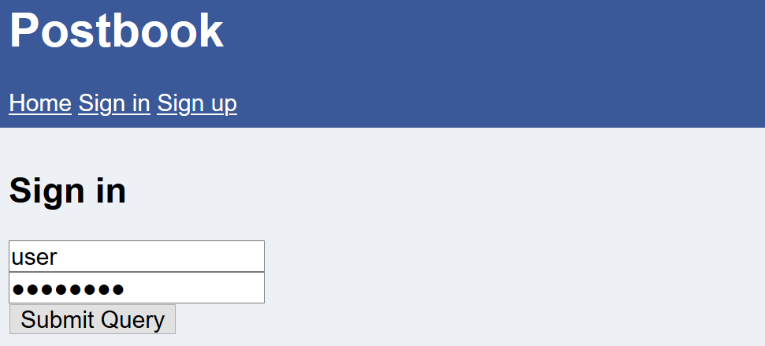](./assets/hacker101-07-user.png)

[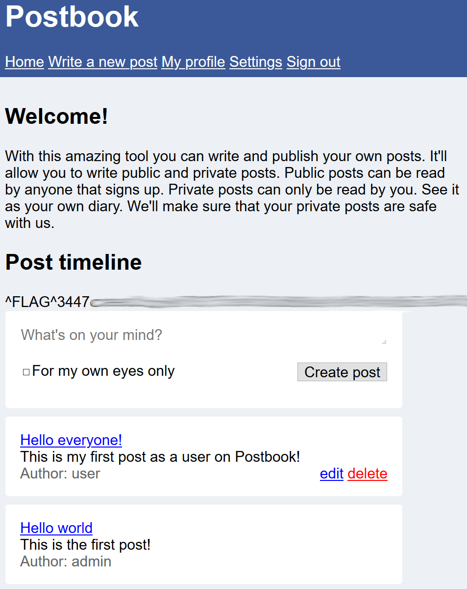](./assets/hacker101-07-flag0.png)

Of course this had to work, we got the first flag. I also tried this for the `admin` account, but this did not work that easily. But as you will see later, there are other ways. For now, we log back into our own account and further look around on the site.

## flag1 - The hidden post

The frontpage mainly consists of posts made by the users. We can create posts and also mark them as `For my own eyes only`... I wonder how that works? We already have two posts on the site. We can open them directly with the respective URL. The first post can be accessed like this:

`/index.php?page=view.php&id=1`

[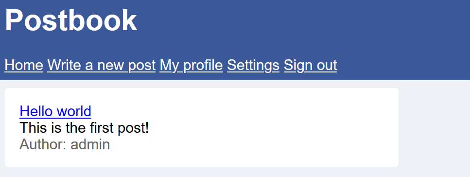](./assets/hacker101-07-post1.png)

The next post's link makes us perform the following query:

`/index.php?page=view.php&id=3`

[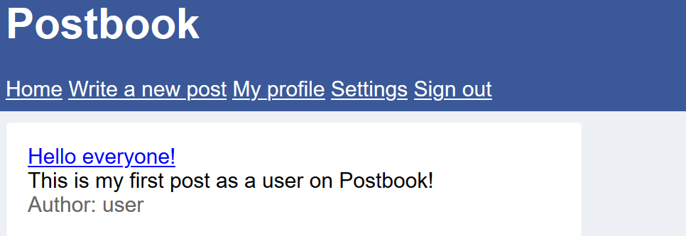](./assets/hacker101-07-post3.png)

That's odd. What about ID `2`? There is one way to find out:

`/index.php?page=view.php&id=2`

[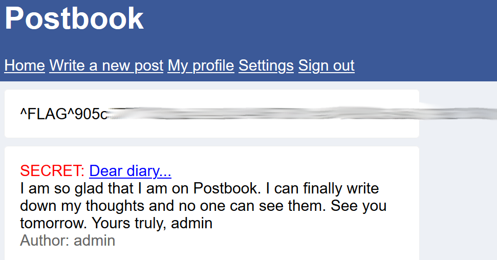](./assets/hacker101-07-flag1.png)

It seems, `For my own eyes only` means that it is just not displayed on the main page. Very secure. The admin probably never thought anyone would guess the ID of their post. Well, we got the next flag.

## flag2 - Let me tell you who I am.

Now we take a closer look at how to create a new post. For this we click the link at the top to get to the `Write a new post` page.

[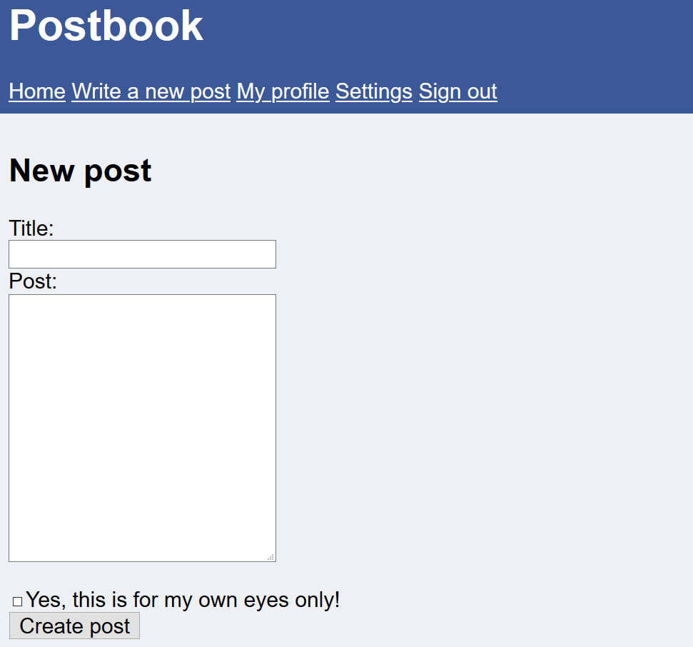](./assets/hacker101-07-new-post.png)

This leads us to a dedicated page for creating posts. Maybe we should further inspect the form. What exactly is sent to the server?

[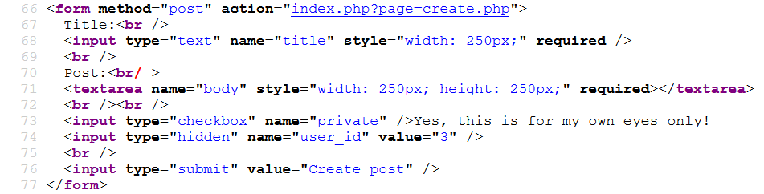](./assets/hacker101-07-new-post-source.png)

In line 74 we can see a hidden input called `user_id`. It is set to value `3`... We know that two other users exist, `user` and `admin`. The latter was presumably the first one to be created. So what if we set the value to `1` and create a new post?

[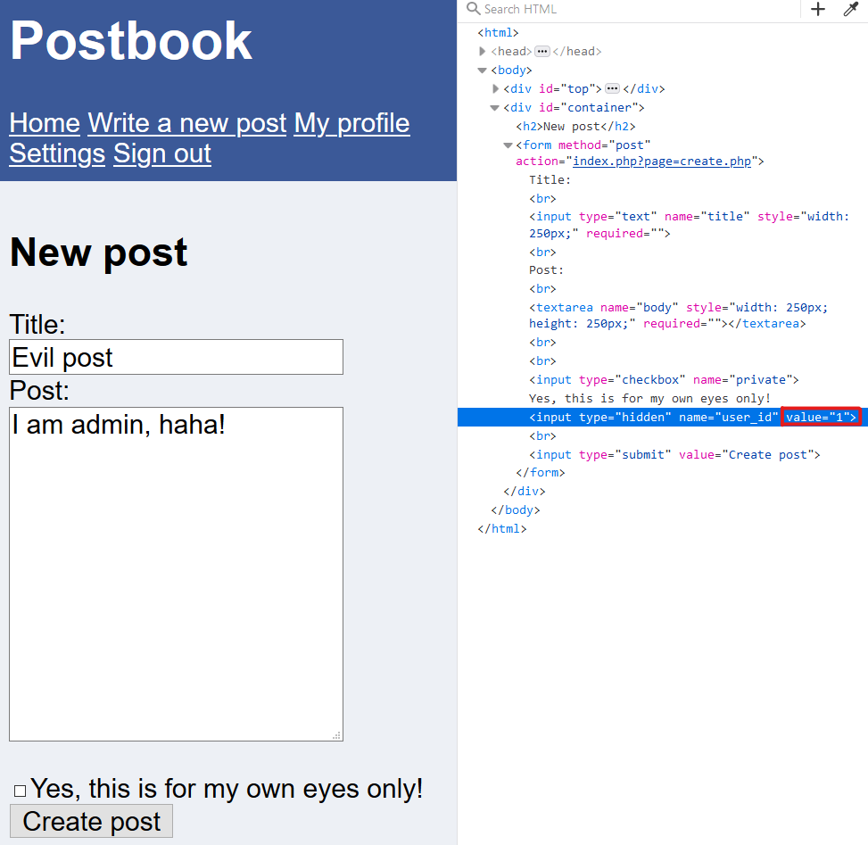](./assets/hacker101-07-evil-post.png)

[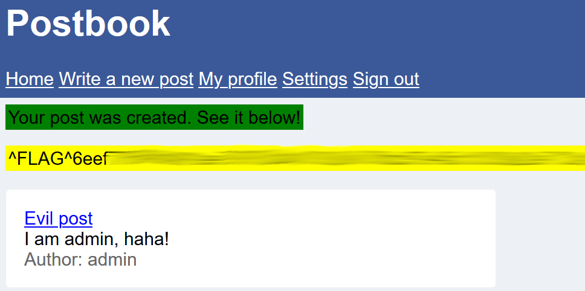](./assets/hacker101-07-flag2.png)

That worked! It says that the new post's author is `admin`. And the next flag is displayed.

## flag3 - 189 * 5

For the following flag, I had to take a look at hacker101's hints, because I just did not find the right approach. The only hint given for that flag is "189 * 5"... Okay? I guess 189 * 5 equals 945. Can we use this somewhere? We were able to open arbitrary posts with their respective ID, so what about this:

`/index.php?page=view.php&id=945`

[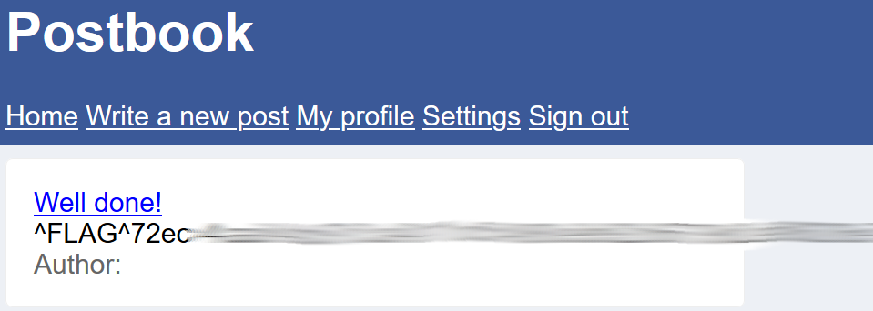](./assets/hacker101-07-flag3.png)

I don't get it. Is this some kind of reference I don't understand? Of course, we could have bruteforced the post IDs to find this and if I were supposed to find vulnerabilities on a real website, this would have definitely been a good idea. But for this challenge it just did not feel right (yet). Whatever, we got the flag. ¯\\_(ツ)_/¯

## flag4 - Let me change that for you

For a change, let's use the page as it is supposed to be. We create a normal new post:

[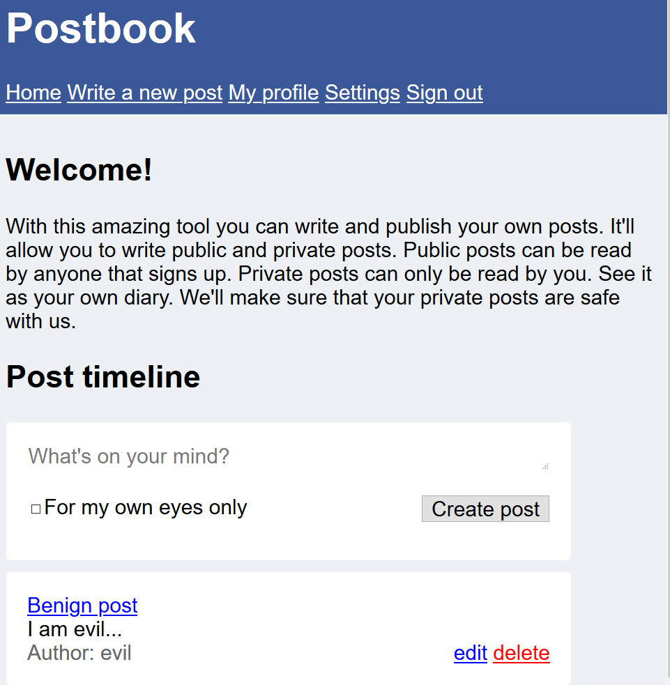](./assets/hacker101-07-post5.png)
    
Now that we are actually the user that created the post, we can `edit` and `delete` it. The link of `edit` leads us to the following query:

`/index.php?page=edit.php&id=5`

We saw with flag1 that we can view hidden posts, even if we are not the correct user. So what if the change this query's ID as well?

`/index.php?page=edit.php&id=2`

[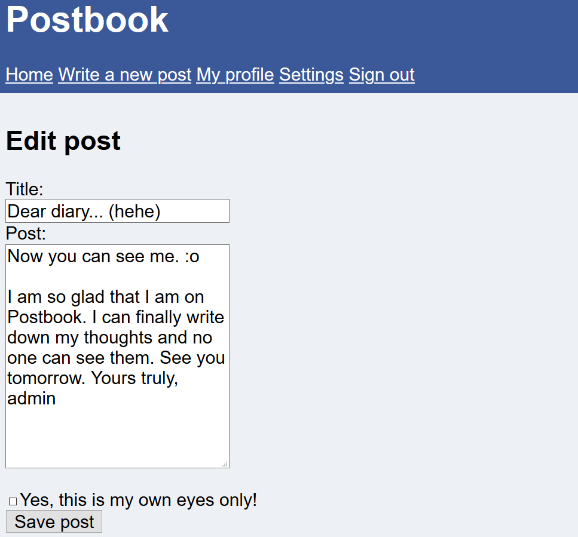](./assets/hacker101-07-edit.png)

We can not only view but also edit the hidden post! Let's change title and body, and make it a public post.

[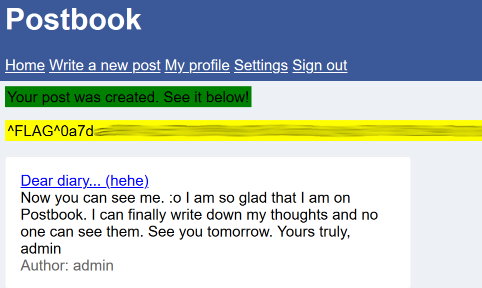](./assets/hacker101-07-flag4.png)

It worked! We got the next flag.

## flag5 - Me want cookie

For the previous flags, we always had the tell the server our user ID explicitly to pretend to be the admin. I am lazy and I would like to just `be` the admin. So how do we achieve this? A good approach would be to take over their session. Usually sessions are controlled with cookies and we probably have one for our session now. Let's see:

[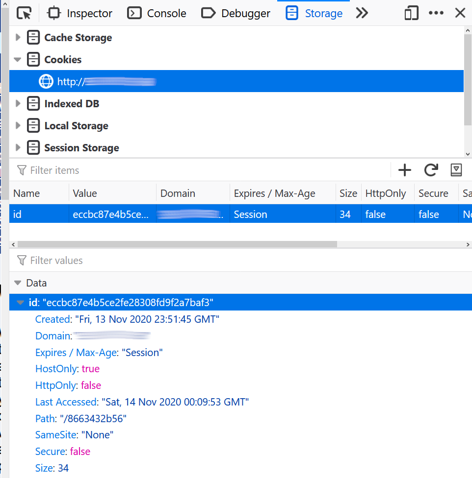](./assets/hacker101-07-cookie.png)

Yup, we got one. And an interesting one as well. The name of the value is `id`. Maybe this corresponds to the user ID that we saw before? And if we remember, `user` and `admin` being the accounts that were created before ours, we are probably the user with ID 3. So `eccbc87e4b5ce2fe28308fd9f2a7baf3` somehow must refer to that.

Let's think about that hex string a bit more. These are 16 bytes. This incidentally is also the digest size of MD5. As this flag most probably is as easy to solve as the others and [Occam's razor]("https://en.wikipedia.org/wiki/Occam%27s_razor") can often be applied... Maybe this is just the MD5 hash value of `3`? Let's test that with this command for a Linux shell:

`echo -n "3" | md5sum`

[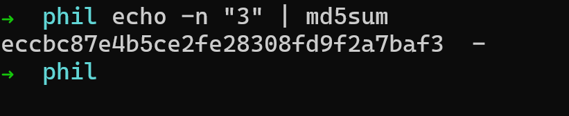](./assets/hacker101-07-md5.png)

Jackpot. All we need to do now is to calculate the digest for `1` (`c4ca4238a0b923820dcc509a6f75849b`) and set this as the cookie value. What does the frontpage look like now?

[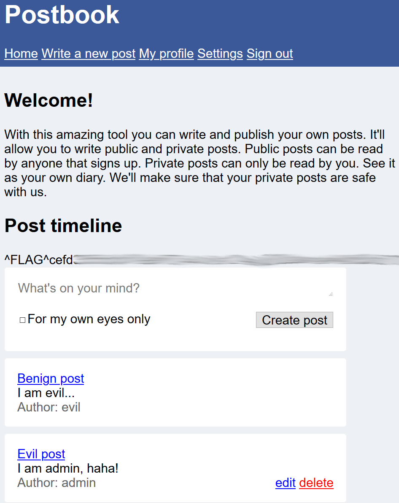](./assets/hacker101-07-flag5.png)

We are admin now (we know this because we can edit and delete posts with `Author: admin`). And we got the next flag. Remember kids: A hash is not encryption!

## flag6 - This is getting ridiculous

The life as admin got a bit too busy, so let's switch back to our own user, `evil`. We take look at how the `delete` command works. If we click it, we perform the following query:

`/index.php?page=delete.php&id=e4da3b7fbbce2345d7772b0674a318d5`

Hmm, we do not provide a plain ID but rather another hex string. This looks really similar to the cookie value from before. Maybe it's just MD5 again? Looking at the currently existing posts, this should be ID `5`... Let's double check:

[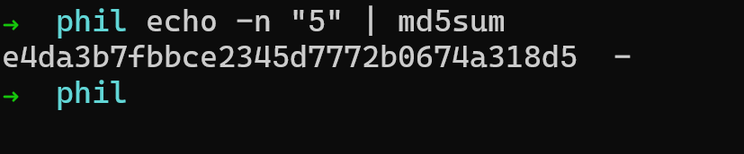](./assets/hacker101-07-delete-md5.png)

That check's out! The first post on the page is a public post made by admin. Of course we could just use their session again, but why don't we try to delete the post from our session? Just for the fun of it. As it is the first post, it most probably has the ID 1. So let's get the hash from flag5 again and check what happens with this query:

`/index.php?page=delete.php&id=c4ca4238a0b923820dcc509a6f75849b`

[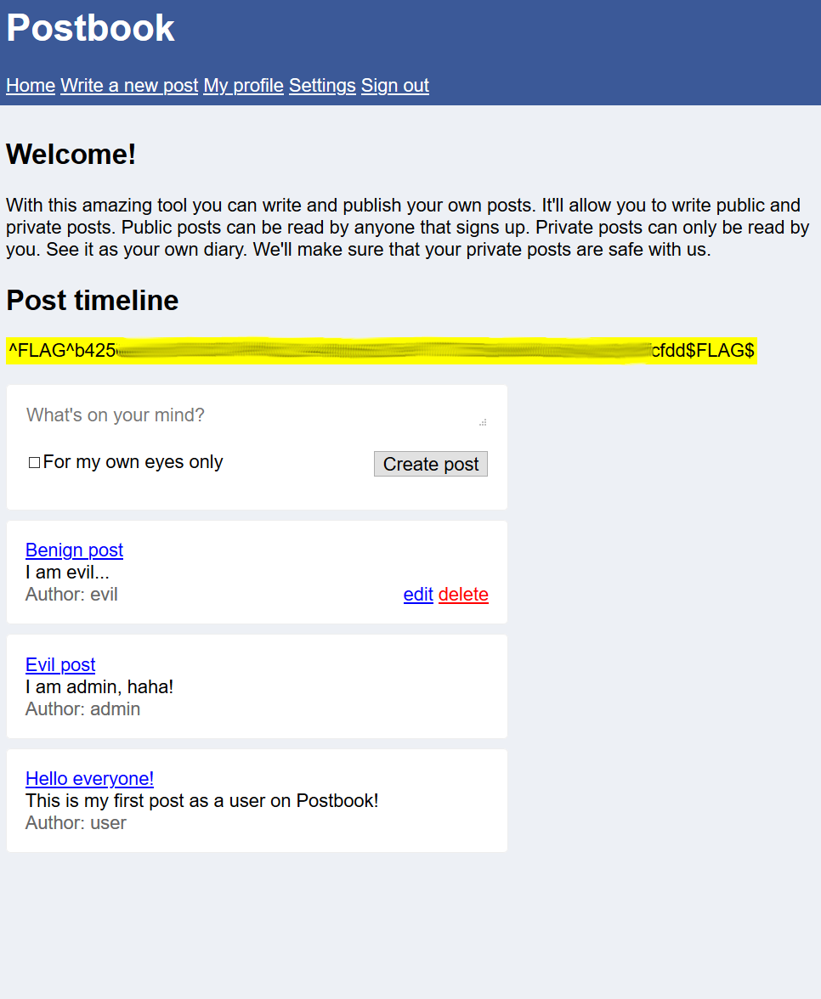](./assets/hacker101-07-flag6.png)

The post is gone and we got the last flag!