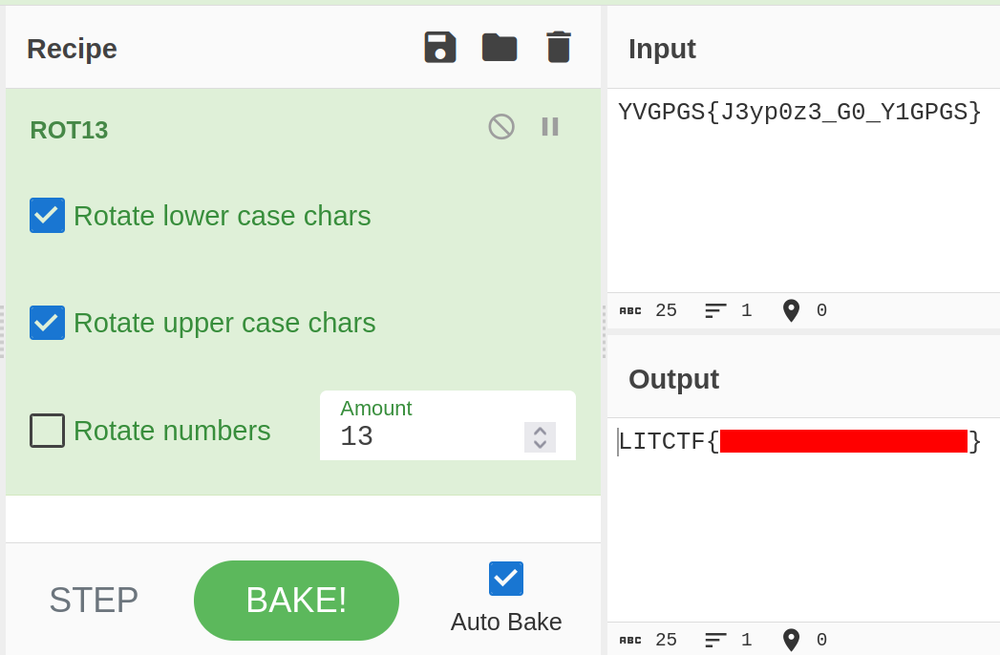

# LIT CTF 2023 - HelloWorld

| Category |
|----------|
| `misc`    | 

## Challenge:

Here's an easy CTF problem for demonstration purposes. I will go get some caesar salad while you solve this.

## Solution:

This one is the starter challenge. We are given a textfile with the following content:

```
YVGPGS{J3yp0z3_G0_Y1GPGS}
```

The challenge text gives an important hint: I will go get some **_caesar_** salad while you solve this.

This is a clear reference to the [Ceasar cipher](https://en.wikipedia.org/wiki/Caesar_cipher). Most often, "ROT13" is used, so using "13" as the key for the cipher. So let's go get an instance of CyberChef and try that on the file's content:

[](./assets/screen0.png)

That's looking good. We have solved our first challenge.