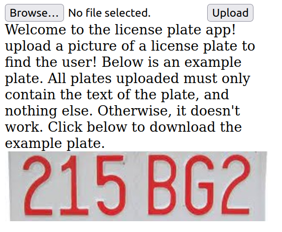

# LIT CTF 2023 - license-inject

| Category |
|----------|
| `web`    | 

## Challenge:

i did a thing

## Solution:

This one is interesting. It seems to resemble a service where you can provide a picture of a license plate and get data about the vehicles holder in response.

[](./assets/screen0.png)

We even get an example plate. Let's try that. This is the response:

```json
{
    "name": "Sample User",
    "plate": "215BG2",
    "fine": "$6942"
}
```

Interesting. Let's take a quick glance at the backend code of the Svelte app that is running this page in the [+server.ts](./assets/files/src/routes/api/+server.ts). It is a bit messy, but we can focus on the interesting lines.

The server uses the Tesseract OCR (Optical Character Recognition) library to read the text from a given plate:

```typescript
import { createWorker } from 'tesseract.js';
const worker = await createWorker({
    logger: (m) => console.log((m.progress * 100).toString() + '%'),
    // workerPath: path.join(process.cwd(), 'static', 'tesseract/worker.min.js'),
    // langPath: 'https://tessdata.projectnaptha.com/4.0.0',
    corePath: path.join(process.cwd(), 'static', 'tesseract/tesseract-core-simd.js')
});
await worker.loadLanguage('eng');
await worker.initialize('eng');
const {
    data: { text: ogText }
} = await worker.recognize(filePath);
await worker.terminate();
text = ogText.trim();
```

So, now the variable `text` contains the content of the provided license plate. This is then used in the following SQL query:

```typescript
db.get(`SELECT * FROM plates WHERE plate = "${text}"`, (err, row) => {
    if (err) return oops(err);
    console.log('queried plate');
    // clean up db [...]
});
```

This smells like SQL injection! The OCR's output is unsafely placed inside that query. Also, from the code it looks like the fine of the holder with the name "codetiger" contains the flag. So, theoretically, we can add any SQL code if we find a picture of a plate that contains that. Luckily, some easy image manipulation can help us here:

[](./assets/plate-edit.jpg)

Uploading this image yields the following response:

```json
{
    "name": "codetiger",
    "plate": "WT76CCR73ETFHPHTEA8VUQ50M0D5MUJUTJH6ADZL",
    "fine": "LITCTF{redacted}"
}
```
