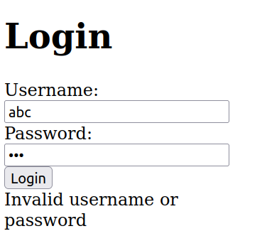
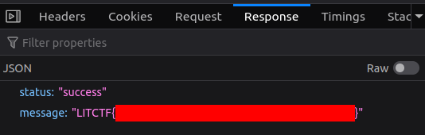

# LIT CTF 2023 - My boss left

| Category |
|----------|
| `web`    | 

## Challenge:

My boss left... Guess I can be a bit more loose on checking people

## Solution:

We are given a link to an instance as well as the source code of the page. After clicking the "Login" button, we see a simple login page. If we try some random credentials, we are not getting far.

[](./assets/screen0.png)

Let's look at the corresponding code. It's a PHP server. We can see the check for logging in line 12 of the [login.php](./assets/files/login.php):

```php
if ($login_data['password'] == $valid_password) {
    // Login successful
    echo json_encode(['status' => 'success', 'message' => 'LITCTF{redacted}']);
}
```

In PHP, that's an unsafe comparison. This article sums up the problem nicely: https://www.invicti.com/blog/web-security/php-type-juggling-vulnerabilities/

If we jump back into the browser, we can see that we are sending the following JSON data when logging in:

```json
{
    "username": "abc",
    "password": "123"
}
```

Using the developer tools, we can easily edit and resend this to force PHP to compare the string with `true`, which always results in `true`:

```json
{
    "username": "abc",
    "password": true
}
```

This is the response:

[](./assets/screen1.png)
