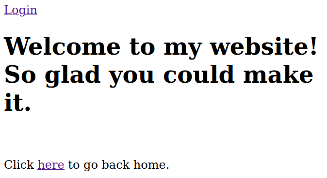
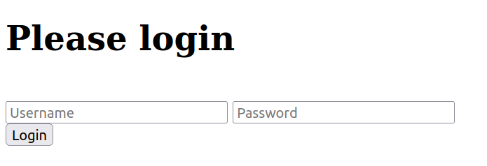
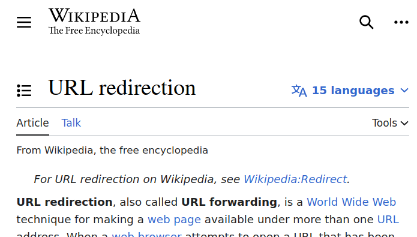

# LIT CTF 2023 - unsecure

| Category |
|----------|
| `web`    | 

## Challenge:

As it turns out, the admin who runs our website is quite insecure. They use password123 as their password.
(Wrap the flag in LITCTF{})

## Solution:

This time we only get an instance. Opening it, only display one simple message:

```
Try going to /welcome instead of here
```

Okay, lets try that. This leads us to this page:

[](./assets/screen0.png)

Clicking `here` only leads us back to the previous page. So let's look at the `Login`.

[](./assets/screen1.png)

Okay, the challenge text mentioned a password, but no username. In that case, it usually is `admin`, so let's try that.

[](./assets/screen2.png)

We have been redirected to Wikipedia... Okay? The page explains how redirects work. But there is nothing else to go on from here. Let's fire up BurpSuite and check what happens when we log in.

- First we send the POST with the login credentials to the page. 
- This redirects us to `/there_might_be_a_flag_here`.
- This again redirects us to `/ornot`...
- And this redirects us to `/[redacted]`. (_Note: This is the flag value, therefore it is redacted here._)
- This then redirects us to `/unsecure`.
- And finally, we are redirected to `/wiki/URL_redirection` of `en.wikipedia.org`.

To be honest, there is nothing really that looks like a flag at first glance. I didn't know what to do here and simply tried all path values as the flag value. One of them worked, so, I guess that was the solution? The only give-away was that it used l33t speak in contrast to the others. But other than that, that was a bit obscure.