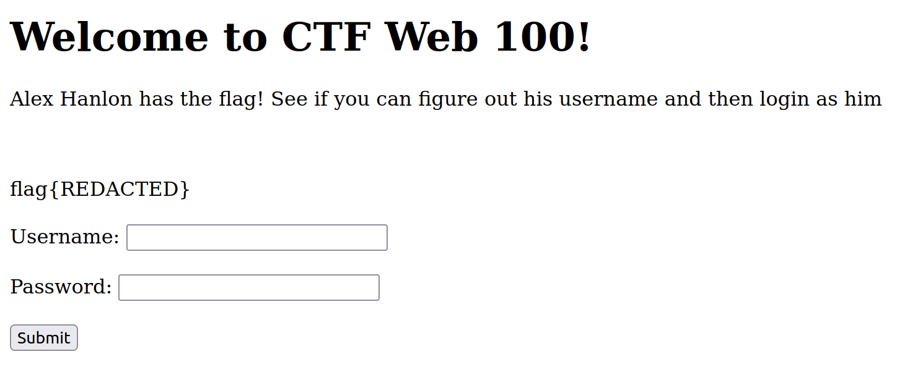

# Square CTF 2022 - Alex Hanlon Has The Flag!

| Points       | Category |
|--------------|----------|
| 50 | `web`    | 

Challenge URL: https://squarectf.com/2022/alexhanlonhastheflag.html

## Challenge:

Alex Hanlon has saved the flag in his account! See if you can figure out his username and then login as him. But just know that it will be impossible to brute force his password.

## Solution:

We start the challenge server by building and running the given docker image with the `docker-compose.yml` from the [ZIP-file](./assets/alexhanlonhastheflag.zip). For this, we use the following command in the directory of the docker-compose file:

```bash
HOST_PORT=8080 docker-compose up -d
```

We can then access the challenge with the following URL: http://localhost:8080/

We are presented with the following website:

[](assets/screen1.png)

The objective is clear: We need to log in as Alex Hanlon. Let's first check how it behaves in general and try to log in with "`username=alex`" and "`password=123456`".

[](assets/screen2.png)

We get the error message "Nope, try again!"

Login forms are often susceptible to SQL injection attacks. To test this, we can suspect that a query like the following is used to check the validity of login credentials:

```SQL
SELECT username FROM users WHERE username='username' AND passwordhash='hash'
```

One could assume that the webserver then internally checks the amount of rows returned by that query. If (at least) one row is returned, the username exists and the correct password was used to calculate the hash.

As the `username` is provided via input from the user, how the query is put together is crucial for the security of the login.

Let's assume the query is built by simply concatenating each part. We can now supply the following input: "`username=' OR 1=1 -- `" and "`password=123456`". This would then result in the following query:

```SQL
SELECT username FROM users WHERE username='' OR 1=1 -- ' AND passwordhash='hash'
```

**Note**: 
The password does not matter if it is hashed, as any input by the user is hashed before it is added to the query.

This resulting query would return all usernames from the `users` table, as `1=1` is always true. Let's see how the server reacts to this input:

[](assets/screen3.png)

We are given the following error message: "Sorry, admin is the wrong user". It sounds like our attack was successful and we would have been able to login as `admin`. But the challenge wants us to login as Alex Hanlon.

If everything works as we expect now, we can pick a specific username in our payload like this: "`username=alex' -- `" and "`password=123456`". This would result in the following query:

```SQL
SELECT username FROM users WHERE username='alex' -- ' AND passwordhash='hash'
```

With this, all we need is the username to login as any user. But we do not know Alex Hanlon's username. Nonetheless, we can test some likely possibilities:
- `alex`
- `hanlon`
- `alexhanlon`
- `alex.hanlon`
- `alexh`
- `ahanlon`

We are successful with the last one and are presented with the flag:

[](assets/screen4.png)

## Prevention:

User input should never be trusted. In general, where possible, it should be validated or filtered with an allow-list. If this is not possible, the input should be escaped.

In context of this challenge, it must not be possible for a user to input characters that are interpreted as any other part of the query as the strings for the username or the password. To prevent this, one should use prepared statements ([Wikipedia](https://en.wikipedia.org/wiki/Prepared_statement)).

We can take a closer look at how this is solved in case of this challenge as we have the source code available. From `src/main/java/com/example/alexhanlonhastheflag/MainController.java` in lines `35-36`:

```java
Statement statement = connection.createStatement();
ResultSet resultSet = statement.executeQuery("SELECT username FROM user WHERE username='"+username+"' AND password='"+password+"'");
```

First of all, we were correct with our assumption on how the query is put together. We can also see that the passwords are used and stored in plaintext. Another big no-no, but this is not the focus of this challenge.

To fix this, we need to use Java's way of building a prepared statement:

```java
import java.sql.PreparedStatement;
// [...]
PreparedStatement statement = connection.prepareStatement("SELECT username FROM user WHERE username=? AND password=?");
statement.setString(1, username);
statement.setString(2, password);
ResultSet resultSet = statement.executeQuery();
```

Now, any input given by the user is correctly escaped and characters like "`'`" or "`--`" are not interpreted as part of the query anymore.