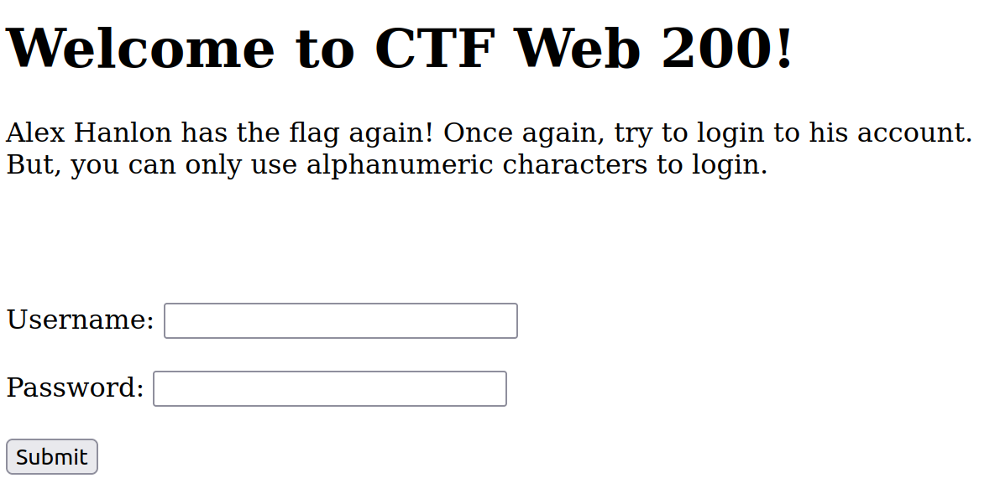
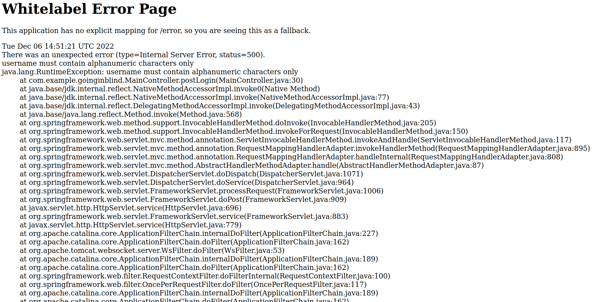
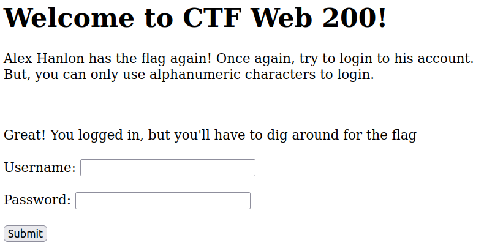

# Square CTF 2022 - Going In Blind

| Points       | Category |
|--------------|----------|
| 200 | `web`    | 

Challenge URL: https://squarectf.com/2022/goinginblind.html

## Challenge:

Ok, the developers got smart, and figured out a way to prevent SQLi in the login page. Plus, they decided the flag shouldn't be hardcoded in the web application anymore. How could anyone get to it now?

## Solution:

This challenge is the same setup as [the previous one](./../alex-hanlon-has-the-flag/). If you have not read that, I highly recommend you do that now. 

We need to login as Alex Hanlon again. But the challenge suggests that it won't be as easy as before.

We start the challenge server as before by building and running the given docker image with the `docker-compose.yml` from the [ZIP-file](./assets/goinginblind.zip). For this, we use the following command in the directory of the docker-compose file:

```bash
HOST_PORT=8080 docker-compose up -d
```

We can then access the challenge with the following URL: http://localhost:8080/

We are presented with the following website:

[](./assets/screen1.png)

Let's simply try the same payload that worked the last time: "`username=ahanlon' -- `" and "`password=123456`". But the browser already stops us. The input fields prevents us from sending anything that does not match the following pattern: `[A-Za-z0-9]*`

As this is enforced on the client's side, we can easily circumvent this by removing `pattern="[A-Za-z0-9]*"` from the both input fields. This is the response if we send the request:

[](./assets/screen2.png)

We get a full stack trace. Here we can see that the limitation of only being able to use alphanumeric characters is also enforced on the server's side. This seems to be a dead end.

But we can try something else: Sending the data via GET instead of POST by requesting the following URL:

http://localhost:8080/?username=ahanlon%27+--+&password=123456

We get the following response:

[](./assets/screen3.png)

The login itself seems to have been successful. But there is no flag this time. The challenge text gives the impressions that the flag could be stored in the database. So we should try to find a way to read arbitrary data from the database.

Luckily, this is possible, as we can distinguish between two states that depend on a database query:
- The login was successful
- The login was unsuccessful

With this, we can perform a blind SQL injection. We can send a query and guess each character of the response. If the guess is correct, we can force the login to be successful, and vice versa. The core of this is the following input for the `username` field:

```
ahanlon' AND 1=IF(BINARY SUBSTR(({query} LIMIT {row},1), {pos}, 1) = '{guess}', 1, 2) -- 
```

`{query}` is the main query that we want to execute and of which we want to read the result from the database.

`{row}` specifies the row of the result which is to be returned. To get all rows, one need to increment this value for each row, starting from 0.

`{pos}` is the position of the character in the result that we want to guess.

`{guess}` is our guess for the charater.

`BINARY SUBSTR(string, position, length)` returns a substring of the given `string` with a given `length` starting from a given `position`.

`IF(condition, true_result, false_result)` returns the `true_result` if the `condition` evaluates as true and returns the `false_result` otherwise.

All of this combined results in the following input into the user-lookup query, if we guess the character correctly: `ahanlon' AND 1=1 -- `. In this case, the login succeeds.

If we guessed incorrectly, the following string is created: `ahanlon' AND 1=2 -- `. With this, the login fails.

As this is way to tedious to do manually, I implemented this in [injector.py](./injector.py). It can be used like this:

```bash
$ python injector -q "SELECT username FROM user"
admin
ahanlon
```

With this tool at hand, we can freely query for any information we want in the database. Let's first find out which tables exist in the database:

```bash
$ python injector.py -q "SELECT TABLE_NAME FROM INFORMATION_SCHEMA.TABLES"
flag
user
ADMINISTRABLE_ROLE_AUTHORIZATIONS
APPLICABLE_ROLES
CHARACTER_SETS
Aborted query after 5 results
```

The table `flag` sounds very interesting. Let's find out which columns exist in this table:

```bash
$ python injector.py -q "SELECT COLUMN_NAME FROM INFORMATION_SCHEMA.COLUMNS WHERE TABLE_NAME='flag'"
flag
```

All we need to do now is to query for the flag:

```bash
$ python injector.py -q "SELECT flag FROM flag"                                                   
flag{REDACTED}
```

## Prevention:

As we can see, the proposed "solution" to secure the login is ineffective. Limiting the allowed inputs on the client's side never achieves anything. 

The best way to go are prepared statements. See [my advisory from the previous challenge](https://github.com/pkemkes/ctf-writeups/tree/main/squarectf2022/alex-hanlon-has-the-flag#prevention).